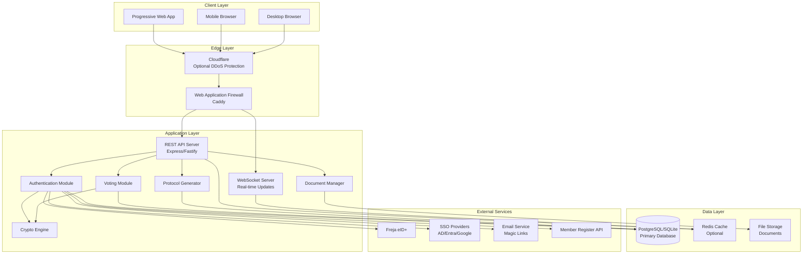
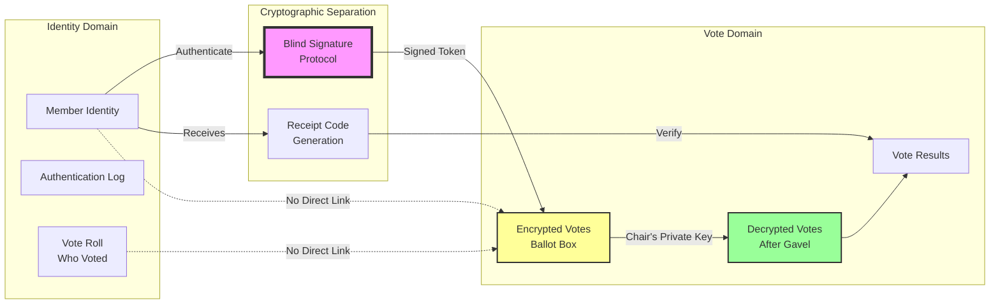
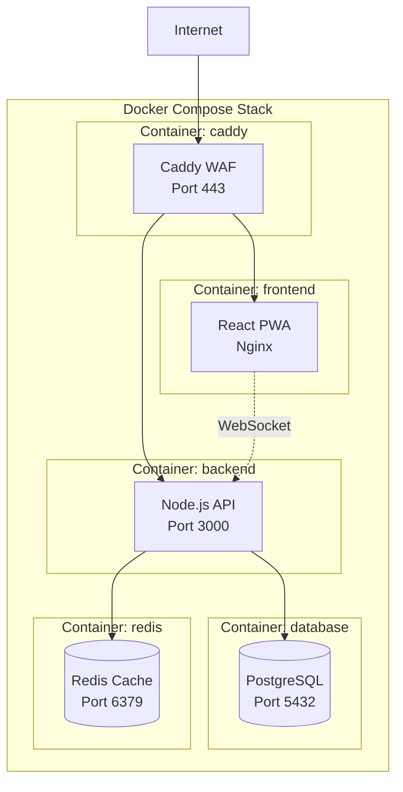
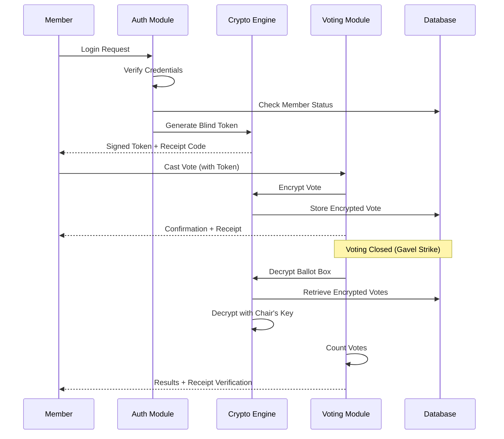
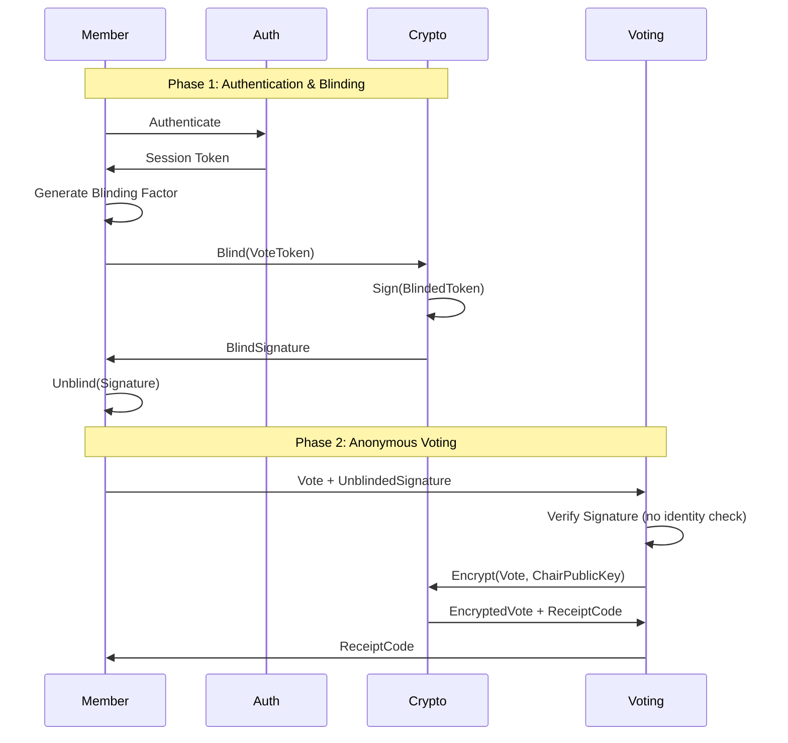
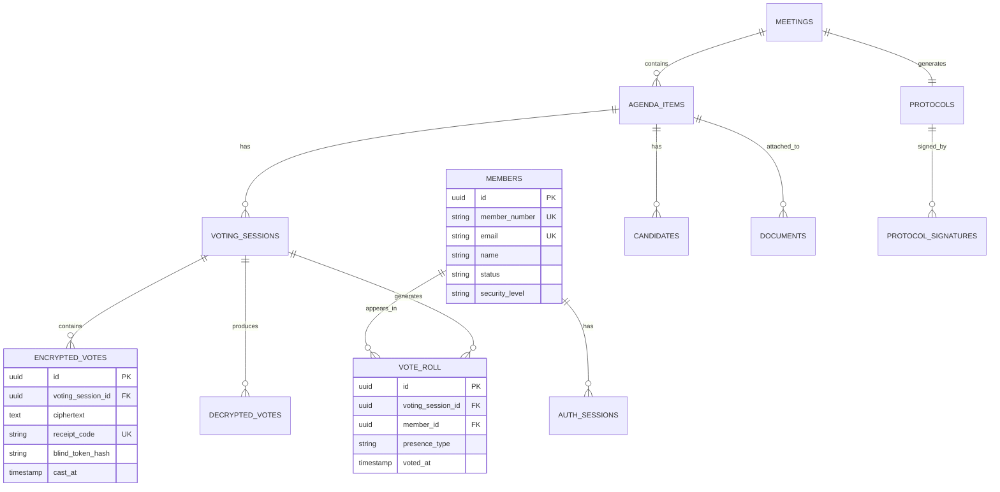

# Design Document - Digital Voting System

## Overview

### Purpose

This design document describes the architecture and implementation approach for a secure digital voting system for Swedish associations. The system replaces paper-based postal voting with a cryptographically secure, transparent, and accessible digital solution that complies with Swedish association law, GDPR, and accessibility standards.

### Key Design Goals

1. **Security First**: Cryptographic separation between voter identity and vote content using blind signatures
2. **Transparency**: End-to-end verifiability allowing members to confirm their votes were counted
3. **Accessibility**: WCAG 2.1 AA compliance ensuring equal participation for all members
4. **Portability**: Runs on laptop, VPS, or cloud with single-command deployment
5. **Usability**: Intuitive interface requiring minimal technical knowledge
6. **Compliance**: GDPR with archive law exceptions, Swedish association law

### System Scope

The system supports:

- Pre-meeting voting (förtidsröstning) with unlimited vote changes
- Live voting during meetings with real-time results
- Multiple voting methods (simple majority, STV, Schulze, approval voting)
- Multiple authentication methods (Freja eID+, SSO, Magic Link, QR codes)
- Automatic protocol generation with digital signatures
- Document management with format conversion
- Comprehensive audit logging
- Multi-language support (Swedish/English)

### Technology Stack Recommendations

**Backend**:

- Language: Node.js (TypeScript) with Express or Fastify
- Database: PostgreSQL (production), SQLite (small installations)
- Cryptography: Node.js `crypto` module (standard library only)
- Document conversion: Pandoc, pdftotext

**Frontend**:

- Framework: React with TypeScript
- Architecture: Progressive Web App (PWA)
- State management: React Context + hooks
- Real-time: WebSocket for live updates

**Infrastructure**:

- Containerization: Docker + Docker Compose
- WAF: Caddy (built-in security features)
- Orchestration: Kubernetes with Helm charts (optional)
- Deployment: Single command `docker-compose up -d`

## Architecture

### High-Level System Architecture



### Security Architecture



### Deployment Architecture



### Component Interaction Flow



## Components and Interfaces

### Authentication Module

**Responsibilities**:

- Verify member identity through multiple authentication methods
- Integrate with member register (API, CSV, LDAP)
- Generate blind signature tokens for anonymous voting
- Manage session state and security levels
- Log all authentication attempts

**Key Interfaces**:

```typescript
interface AuthenticationModule {
  // Authentication methods
  authenticateFrejaEID(personalNumber: string): Promise<AuthResult>;
  authenticateSSO(provider: SSOProvider, token: string): Promise<AuthResult>;
  authenticateMagicLink(token: string): Promise<AuthResult>;
  authenticateQRCode(code: string): Promise<AuthResult>;
  authenticatePassword(
    username: string,
    password: string,
    mfaCode?: string,
  ): Promise<AuthResult>;

  // Member verification
  verifyMemberStatus(memberId: string): Promise<MemberStatus>;

  // Blind signature generation
  generateBlindToken(memberId: string): Promise<BlindToken>;

  // Session management
  createSession(memberId: string, authMethod: AuthMethod): Promise<Session>;
  validateSession(sessionToken: string): Promise<Session>;
  revokeSession(sessionToken: string): Promise<void>;
}

interface AuthResult {
  success: boolean;
  memberId?: string;
  securityLevel: SecurityLevel;
  error?: string;
}

enum SecurityLevel {
  VERY_HIGH = "very_high", // Freja eID+ with API
  HIGH = "high", // SSO with MFA, Freja with CSV
  MEDIUM = "medium", // Magic Link with API, Password with MFA
  LOW = "low", // QR with manual, Magic Link with CSV
  MANUAL = "manual", // Password without MFA
}
```

### Crypto Engine

**Responsibilities**:

- Implement blind signature protocol for anonymous voting
- Encrypt/decrypt ballot box using asymmetric cryptography
- Generate receipt codes for vote verification
- Manage cryptographic keys securely
- Ensure no linkage between identity and vote content

**Key Interfaces**:

```typescript
interface CryptoEngine {
  // Blind signature protocol
  generateBlindToken(memberId: string): Promise<BlindToken>;
  signBlindToken(blindedToken: string): Promise<string>;
  unblindSignature(
    blindedSignature: string,
    blindingFactor: string,
  ): Promise<string>;

  // Ballot box encryption
  encryptVote(vote: Vote, publicKey: string): Promise<EncryptedVote>;
  decryptBallotBox(
    encryptedVotes: EncryptedVote[],
    privateKey: string,
  ): Promise<Vote[]>;

  // Receipt generation
  generateReceiptCode(vote: Vote): Promise<string>;
  verifyReceiptCode(
    receiptCode: string,
    publishedVotes: PublishedVote[],
  ): Promise<boolean>;

  // Key management
  generateKeyPair(): Promise<KeyPair>;
  exportPublicKey(keyPair: KeyPair): string;
  importPrivateKey(privateKeyPEM: string): Promise<PrivateKey>;
}

interface BlindToken {
  token: string;
  blindingFactor: string;
  signature: string;
}

interface EncryptedVote {
  ciphertext: string;
  timestamp: Date;
  receiptCode: string;
}

interface KeyPair {
  publicKey: string;
  privateKey: string;
}
```

**Cryptographic Design**:

The system uses a two-layer approach:

1. **Identity Layer**: Blind signatures (RSA-2048 minimum) separate authentication from voting
2. **Privacy Layer**: Asymmetric encryption (RSA-4096 minimum) protects vote content until decryption



### Voting Module

**Responsibilities**:

- Manage voting sessions for agenda items
- Store encrypted votes in ballot box
- Count votes using appropriate voting method
- Generate vote rolls (who voted, not what)
- Handle vote changes during pre-voting period
- Enforce quorum requirements

**Key Interfaces**:

```typescript
interface VotingModule {
  // Voting session management
  openVoting(
    agendaItemId: string,
    config: VotingConfig,
  ): Promise<VotingSession>;
  closeVoting(
    sessionId: string,
    chairPrivateKey: string,
  ): Promise<VotingResults>;
  extendVoting(sessionId: string, additionalMinutes: number): Promise<void>;

  // Vote casting
  castVote(
    sessionId: string,
    blindToken: string,
    vote: Vote,
  ): Promise<VoteReceipt>;
  changeVote(
    sessionId: string,
    blindToken: string,
    newVote: Vote,
  ): Promise<VoteReceipt>;

  // Vote counting
  countVotes(votes: Vote[], method: VotingMethod): Promise<VotingResults>;

  // Vote roll management
  getVoteRoll(sessionId: string): Promise<VoteRoll>;

  // Statistics
  getVotingStatistics(sessionId: string): Promise<VotingStatistics>;
}

interface VotingConfig {
  agendaItemId: string;
  method: VotingMethod;
  quorumType: QuorumType;
  quorumThreshold: number;
  allowAbstain: boolean;
  maxSelections?: number; // For approval voting
  positions?: number; // For elections
  candidates?: Candidate[];
}

enum VotingMethod {
  SIMPLE_MAJORITY = "simple_majority",
  ABSOLUTE_MAJORITY = "absolute_majority",
  QUALIFIED_MAJORITY = "qualified_majority",
  STV = "stv",
  APPROVAL = "approval",
  SCHULZE = "schulze",
}

enum QuorumType {
  SIMPLE = "simple", // > 50% of votes
  ABSOLUTE = "absolute", // > 50% of eligible voters
  QUALIFIED = "qualified", // Configurable threshold
}

interface Vote {
  type: "yes" | "no" | "abstain" | "ranked" | "approval";
  value?: boolean | string[] | number[];
  timestamp: Date;
}

interface VoteReceipt {
  receiptCode: string;
  timestamp: Date;
  agendaItemId: string;
}

interface VotingResults {
  agendaItemId: string;
  method: VotingMethod;
  totalVotes: number;
  results: VoteResult[];
  quorumMet: boolean;
  winner?: string | string[];
}

interface VoteRoll {
  agendaItemId: string;
  voters: VoterRecord[];
  totalPhysical: number;
  totalDigital: number;
}

interface VoterRecord {
  memberId: string; // Hashed or anonymized
  memberName: string;
  presence: "physical" | "digital";
  timestamp: Date;
  securityLevel: SecurityLevel;
}
```

### Protocol Generator

**Responsibilities**:

- Generate meeting protocols automatically from agenda and results
- Number decisions sequentially
- Include all required protocol elements per Swedish association law
- Support digital signatures
- Export protocols in multiple formats

**Key Interfaces**:

```typescript
interface ProtocolGenerator {
  // Protocol generation
  createProtocol(meetingId: string): Promise<Protocol>;
  updateProtocol(
    protocolId: string,
    updates: ProtocolUpdate,
  ): Promise<Protocol>;
  finalizeProtocol(protocolId: string): Promise<Protocol>;

  // Signing
  addSignature(
    protocolId: string,
    signerId: string,
    signature: DigitalSignature,
  ): Promise<void>;
  verifySignatures(protocolId: string): Promise<SignatureVerification>;

  // Export
  exportProtocol(
    protocolId: string,
    format: "pdf" | "markdown" | "docx",
  ): Promise<Buffer>;
  calculateChecksum(protocolId: string): Promise<string>;
}

interface Protocol {
  id: string;
  meetingId: string;
  meetingType: "annual" | "extraordinary";

  // Opening
  openingTime: Date;
  location: string;
  chair: Person;
  secretary: Person;
  adjusters: Person[];

  // Attendance
  physicalAttendees: Attendee[];
  digitalAttendees: Attendee[];

  // Agenda items and decisions
  items: ProtocolItem[];

  // Closing
  closingTime: Date;

  // Signatures
  signatures: DigitalSignature[];

  // Metadata
  version: number;
  checksum: string;
}

interface ProtocolItem {
  number: string; // e.g., "§1", "§2"
  title: string;
  description: string;
  documents: string[]; // References to attached documents
  decision?: Decision;
  notes: string[];
}

interface Decision {
  number: string; // e.g., "ÅM2025-001"
  type: "statute_change" | "budget" | "election" | "other";
  text: string;
  votingResults: VotingResults;
  timestamp: Date;
}

interface DigitalSignature {
  signerId: string;
  signerName: string;
  role: "chair" | "secretary" | "adjuster";
  signature: string;
  timestamp: Date;
  method: "freja" | "bankid" | "manual";
}
```

### Document Manager

**Responsibilities**:

- Accept documents in multiple formats (PDF, Word, Markdown, images)
- Convert documents to responsive Markdown format
- Preserve original files for download
- Manage document versions
- Link documents to agenda items

**Key Interfaces**:

```typescript
interface DocumentManager {
  // Upload and conversion
  uploadDocument(file: File, agendaItemId?: string): Promise<Document>;
  convertToMarkdown(documentId: string): Promise<string>;
  previewConversion(documentId: string): Promise<string>;
  approveConversion(documentId: string, editedMarkdown?: string): Promise<void>;

  // Document management
  getDocument(documentId: string): Promise<Document>;
  updateDocument(
    documentId: string,
    updates: DocumentUpdate,
  ): Promise<Document>;
  deleteDocument(documentId: string): Promise<void>;

  // Version control
  getDocumentVersions(documentId: string): Promise<DocumentVersion[]>;

  // Export
  exportOriginal(documentId: string): Promise<Buffer>;
  exportMarkdown(documentId: string): Promise<string>;
}

interface Document {
  id: string;
  title: string;
  originalFormat: "pdf" | "docx" | "doc" | "md" | "jpg" | "png" | "webp";
  originalFile: string; // File path or storage key
  markdownContent?: string;
  conversionStatus: "pending" | "success" | "failed" | "manual";
  agendaItemId?: string;
  uploadedBy: string;
  uploadedAt: Date;
  version: number;
}

interface DocumentVersion {
  version: number;
  content: string;
  changedBy: string;
  changedAt: Date;
  changeReason: string;
}
```

### Audit Logger

**Responsibilities**:

- Log all security-relevant events
- Create append-only log with cryptographic chain
- Anonymize personal data after meeting
- Provide audit trail for compliance

**Key Interfaces**:

```typescript
interface AuditLogger {
  // Logging
  logAuthentication(event: AuthEvent): Promise<void>;
  logAdminAction(event: AdminEvent): Promise<void>;
  logVoteCount(event: VoteCountEvent): Promise<void>;
  logSystemError(event: ErrorEvent): Promise<void>;
  logDataAccess(event: AccessEvent): Promise<void>;

  // Retrieval
  getAuditLog(filter: AuditFilter): Promise<AuditEntry[]>;
  exportAuditLog(format: "json" | "csv"): Promise<Buffer>;

  // Verification
  verifyLogIntegrity(): Promise<IntegrityCheck>;

  // GDPR compliance
  anonymizePersonalData(meetingId: string): Promise<void>;
}

interface AuditEntry {
  id: string;
  timestamp: Date;
  type: AuditEventType;
  actor: string; // Anonymized after meeting
  action: string;
  resource: string;
  result: "success" | "failure";
  ipAddress?: string; // Anonymized after meeting
  details: Record<string, any>;
  previousHash: string;
  currentHash: string;
}

enum AuditEventType {
  AUTH_SUCCESS = "auth_success",
  AUTH_FAILURE = "auth_failure",
  ADMIN_CHANGE = "admin_change",
  VOTE_CAST = "vote_cast",
  VOTE_COUNT = "vote_count",
  DATA_ACCESS = "data_access",
  SYSTEM_ERROR = "system_error",
}
```

### API Design

**REST API Endpoints**:

```
Authentication:
POST   /api/v1/auth/freja          - Authenticate with Freja eID+
POST   /api/v1/auth/sso            - Authenticate with SSO
POST   /api/v1/auth/magic-link     - Request magic link
GET    /api/v1/auth/magic-link/:token - Verify magic link
POST   /api/v1/auth/qr             - Authenticate with QR code
POST   /api/v1/auth/password       - Authenticate with password
POST   /api/v1/auth/logout         - Logout
GET    /api/v1/auth/session        - Get current session

Members:
GET    /api/v1/members             - List members (admin only)
POST   /api/v1/members             - Add member (admin only)
PUT    /api/v1/members/:id         - Update member (admin only)
GET    /api/v1/members/pending     - List pending approvals (election committee)
POST   /api/v1/members/:id/approve - Approve member (election committee)

Meetings:
GET    /api/v1/meetings            - List meetings
POST   /api/v1/meetings            - Create meeting (admin only)
GET    /api/v1/meetings/:id        - Get meeting details
PUT    /api/v1/meetings/:id        - Update meeting (admin only)
GET    /api/v1/meetings/:id/agenda - Get agenda
POST   /api/v1/meetings/:id/start  - Start meeting (chair only)
POST   /api/v1/meetings/:id/pause  - Pause meeting (chair only)
POST   /api/v1/meetings/:id/close  - Close meeting (chair only)

Voting:
POST   /api/v1/voting/sessions     - Open voting session (chair only)
GET    /api/v1/voting/sessions/:id - Get voting session details
POST   /api/v1/voting/sessions/:id/vote - Cast vote
PUT    /api/v1/voting/sessions/:id/vote  - Change vote
POST   /api/v1/voting/sessions/:id/close - Close voting (chair only)
GET    /api/v1/voting/sessions/:id/results - Get results (after close)
GET    /api/v1/voting/sessions/:id/roll   - Get vote roll
POST   /api/v1/voting/verify       - Verify receipt code

Documents:
GET    /api/v1/documents           - List documents
POST   /api/v1/documents           - Upload document (admin only)
GET    /api/v1/documents/:id       - Get document
GET    /api/v1/documents/:id/original - Download original file
GET    /api/v1/documents/:id/markdown - Get markdown version
PUT    /api/v1/documents/:id       - Update document (admin only)
DELETE /api/v1/documents/:id       - Delete document (admin only)

Protocols:
GET    /api/v1/protocols/:meetingId - Get protocol
POST   /api/v1/protocols/:id/sign   - Sign protocol
GET    /api/v1/protocols/:id/export - Export protocol (PDF/Markdown/DOCX)
GET    /api/v1/protocols/:id/verify - Verify signatures

Audit:
GET    /api/v1/audit/logs          - Get audit logs (auditor only)
GET    /api/v1/audit/export        - Export audit logs (auditor only)
POST   /api/v1/audit/verify        - Verify log integrity

Statistics:
GET    /api/v1/stats/dashboard     - Get real-time dashboard
GET    /api/v1/stats/meeting/:id   - Get meeting statistics
GET    /api/v1/stats/security      - Get security level distribution (election committee)

System:
GET    /api/v1/system/health       - Health check
GET    /api/v1/system/config       - Get system configuration
POST   /api/v1/system/dump         - Create data dump (admin only)
POST   /api/v1/system/restore      - Restore from dump (admin only)
```

**WebSocket Events**:

```typescript
// Client -> Server
{
  "type": "subscribe",
  "channel": "meeting:123" | "voting:456" | "dashboard"
}

// Server -> Client
{
  "type": "voting.opened",
  "data": { "sessionId": "456", "agendaItem": "..." }
}

{
  "type": "voting.updated",
  "data": { "sessionId": "456", "votesCast": 42, "percentage": 65 }
}

{
  "type": "voting.closed",
  "data": { "sessionId": "456", "results": {...} }
}

{
  "type": "dashboard.updated",
  "data": { "loggedIn": 87, "physical": 45, "digital": 42 }
}
```

## Data Models

### Database Schema

**Core Entities**:

```sql
-- Members (Identity Domain)
CREATE TABLE members (
  id UUID PRIMARY KEY,
  member_number VARCHAR(50) UNIQUE NOT NULL,
  email VARCHAR(255) UNIQUE NOT NULL,
  name VARCHAR(255) NOT NULL,
  country VARCHAR(2),
  status VARCHAR(20) NOT NULL, -- active, inactive, pending
  security_level VARCHAR(20) NOT NULL,
  created_at TIMESTAMP NOT NULL,
  updated_at TIMESTAMP NOT NULL,
  deleted_at TIMESTAMP -- Soft delete after meeting
);

CREATE INDEX idx_members_status ON members(status);
CREATE INDEX idx_members_email ON members(email);

-- Authentication Sessions
CREATE TABLE auth_sessions (
  id UUID PRIMARY KEY,
  member_id UUID NOT NULL REFERENCES members(id),
  session_token VARCHAR(255) UNIQUE NOT NULL,
  auth_method VARCHAR(50) NOT NULL,
  security_level VARCHAR(20) NOT NULL,
  ip_address INET,
  user_agent TEXT,
  created_at TIMESTAMP NOT NULL,
  expires_at TIMESTAMP NOT NULL,
  revoked_at TIMESTAMP
);

CREATE INDEX idx_sessions_token ON auth_sessions(session_token);
CREATE INDEX idx_sessions_member ON auth_sessions(member_id);

-- Blind Tokens (Cryptographic Separation)
CREATE TABLE blind_tokens (
  id UUID PRIMARY KEY,
  token_hash VARCHAR(64) UNIQUE NOT NULL, -- SHA-256 hash
  signature TEXT NOT NULL,
  issued_at TIMESTAMP NOT NULL,
  used_at TIMESTAMP,
  session_id UUID REFERENCES auth_sessions(id)
);

CREATE INDEX idx_blind_tokens_hash ON blind_tokens(token_hash);

-- Meetings
CREATE TABLE meetings (
  id UUID PRIMARY KEY,
  type VARCHAR(20) NOT NULL, -- annual, extraordinary
  title VARCHAR(255) NOT NULL,
  location VARCHAR(255),
  scheduled_start TIMESTAMP NOT NULL,
  actual_start TIMESTAMP,
  actual_end TIMESTAMP,
  status VARCHAR(20) NOT NULL, -- planned, active, paused, closed
  chair_id UUID REFERENCES members(id),
  secretary_id UUID REFERENCES members(id),
  config JSONB NOT NULL,
  created_at TIMESTAMP NOT NULL,
  updated_at TIMESTAMP NOT NULL
);

CREATE INDEX idx_meetings_status ON meetings(status);

-- Agenda Items
CREATE TABLE agenda_items (
  id UUID PRIMARY KEY,
  meeting_id UUID NOT NULL REFERENCES meetings(id),
  number VARCHAR(10) NOT NULL, -- §1, §2, etc.
  title VARCHAR(255) NOT NULL,
  description TEXT,
  item_type VARCHAR(50) NOT NULL, -- opening, election, motion, other_business, closing
  order_index INTEGER NOT NULL,
  created_at TIMESTAMP NOT NULL,
  updated_at TIMESTAMP NOT NULL,
  UNIQUE(meeting_id, number)
);

CREATE INDEX idx_agenda_meeting ON agenda_items(meeting_id, order_index);

-- Voting Sessions
CREATE TABLE voting_sessions (
  id UUID PRIMARY KEY,
  agenda_item_id UUID NOT NULL REFERENCES agenda_items(id),
  method VARCHAR(50) NOT NULL,
  quorum_type VARCHAR(20) NOT NULL,
  quorum_threshold DECIMAL(5,2),
  status VARCHAR(20) NOT NULL, -- open, closed
  opened_at TIMESTAMP NOT NULL,
  closed_at TIMESTAMP,
  chair_public_key TEXT NOT NULL,
  config JSONB NOT NULL,
  created_at TIMESTAMP NOT NULL
);

CREATE INDEX idx_voting_agenda ON voting_sessions(agenda_item_id);
CREATE INDEX idx_voting_status ON voting_sessions(status);

-- Encrypted Votes (Vote Domain - NO FOREIGN KEY TO MEMBERS)
CREATE TABLE encrypted_votes (
  id UUID PRIMARY KEY,
  voting_session_id UUID NOT NULL REFERENCES voting_sessions(id),
  ciphertext TEXT NOT NULL,
  receipt_code VARCHAR(64) UNIQUE NOT NULL,
  blind_token_hash VARCHAR(64) NOT NULL, -- Links to blind_tokens, not members
  cast_at TIMESTAMP NOT NULL,
  replaced_by UUID REFERENCES encrypted_votes(id), -- For vote changes
  is_current BOOLEAN NOT NULL DEFAULT true
);

CREATE INDEX idx_votes_session ON encrypted_votes(voting_session_id);
CREATE INDEX idx_votes_receipt ON encrypted_votes(receipt_code);
CREATE INDEX idx_votes_current ON encrypted_votes(voting_session_id, is_current);

-- Decrypted Votes (After voting closes)
CREATE TABLE decrypted_votes (
  id UUID PRIMARY KEY,
  voting_session_id UUID NOT NULL REFERENCES voting_sessions(id),
  vote_data JSONB NOT NULL,
  receipt_code VARCHAR(64) NOT NULL,
  decrypted_at TIMESTAMP NOT NULL
);

CREATE INDEX idx_decrypted_session ON decrypted_votes(voting_session_id);

-- Vote Roll (Who voted, not what they voted)
CREATE TABLE vote_roll (
  id UUID PRIMARY KEY,
  voting_session_id UUID NOT NULL REFERENCES voting_sessions(id),
  member_id UUID NOT NULL REFERENCES members(id),
  presence_type VARCHAR(20) NOT NULL, -- physical, digital
  security_level VARCHAR(20) NOT NULL,
  verified_by UUID REFERENCES members(id), -- For manual verifications
  verification_method VARCHAR(50),
  voted_at TIMESTAMP NOT NULL,
  UNIQUE(voting_session_id, member_id)
);

CREATE INDEX idx_roll_session ON vote_roll(voting_session_id);
CREATE INDEX idx_roll_member ON vote_roll(member_id);
```

```sql
-- Candidates (for elections)
CREATE TABLE candidates (
  id UUID PRIMARY KEY,
  agenda_item_id UUID NOT NULL REFERENCES agenda_items(id),
  name VARCHAR(255) NOT NULL,
  email VARCHAR(255),
  phone VARCHAR(50),
  position VARCHAR(255) NOT NULL,
  profile_picture VARCHAR(255),
  presentation TEXT,
  order_index INTEGER NOT NULL,
  created_at TIMESTAMP NOT NULL
);

CREATE INDEX idx_candidates_agenda ON candidates(agenda_item_id);

-- Documents
CREATE TABLE documents (
  id UUID PRIMARY KEY,
  title VARCHAR(255) NOT NULL,
  original_format VARCHAR(10) NOT NULL,
  original_file_path VARCHAR(500) NOT NULL,
  markdown_content TEXT,
  conversion_status VARCHAR(20) NOT NULL,
  agenda_item_id UUID REFERENCES agenda_items(id),
  uploaded_by UUID NOT NULL REFERENCES members(id),
  uploaded_at TIMESTAMP NOT NULL,
  version INTEGER NOT NULL DEFAULT 1
);

CREATE INDEX idx_documents_agenda ON documents(agenda_item_id);

-- Document Versions
CREATE TABLE document_versions (
  id UUID PRIMARY KEY,
  document_id UUID NOT NULL REFERENCES documents(id),
  version INTEGER NOT NULL,
  content TEXT NOT NULL,
  changed_by UUID NOT NULL REFERENCES members(id),
  changed_at TIMESTAMP NOT NULL,
  change_reason TEXT,
  UNIQUE(document_id, version)
);

CREATE INDEX idx_versions_document ON document_versions(document_id);

-- Protocols
CREATE TABLE protocols (
  id UUID PRIMARY KEY,
  meeting_id UUID NOT NULL REFERENCES meetings(id),
  content JSONB NOT NULL,
  version INTEGER NOT NULL DEFAULT 1,
  checksum VARCHAR(64) NOT NULL,
  finalized_at TIMESTAMP,
  created_at TIMESTAMP NOT NULL,
  updated_at TIMESTAMP NOT NULL
);

CREATE INDEX idx_protocols_meeting ON protocols(meeting_id);

-- Protocol Signatures
CREATE TABLE protocol_signatures (
  id UUID PRIMARY KEY,
  protocol_id UUID NOT NULL REFERENCES protocols(id),
  signer_id UUID NOT NULL REFERENCES members(id),
  signer_role VARCHAR(20) NOT NULL, -- chair, secretary, adjuster
  signature TEXT NOT NULL,
  signature_method VARCHAR(50) NOT NULL,
  signed_at TIMESTAMP NOT NULL,
  UNIQUE(protocol_id, signer_id)
);

CREATE INDEX idx_signatures_protocol ON protocol_signatures(protocol_id);

-- Audit Log (Append-only with cryptographic chain)
CREATE TABLE audit_log (
  id UUID PRIMARY KEY,
  sequence_number BIGSERIAL UNIQUE NOT NULL,
  timestamp TIMESTAMP NOT NULL,
  event_type VARCHAR(50) NOT NULL,
  actor VARCHAR(255), -- Anonymized after meeting
  action VARCHAR(255) NOT NULL,
  resource VARCHAR(255) NOT NULL,
  result VARCHAR(20) NOT NULL,
  ip_address INET, -- Anonymized after meeting
  details JSONB,
  previous_hash VARCHAR(64),
  current_hash VARCHAR(64) NOT NULL,
  created_at TIMESTAMP NOT NULL DEFAULT NOW()
);

CREATE INDEX idx_audit_timestamp ON audit_log(timestamp);
CREATE INDEX idx_audit_type ON audit_log(event_type);
CREATE INDEX idx_audit_sequence ON audit_log(sequence_number);

-- System Configuration
CREATE TABLE system_config (
  key VARCHAR(100) PRIMARY KEY,
  value JSONB NOT NULL,
  updated_by UUID REFERENCES members(id),
  updated_at TIMESTAMP NOT NULL
);

-- Data Dumps (for quick recovery)
CREATE TABLE data_dumps (
  id UUID PRIMARY KEY,
  meeting_id UUID REFERENCES meetings(id),
  dump_type VARCHAR(20) NOT NULL, -- automatic, manual, final
  file_path VARCHAR(500) NOT NULL,
  checksum VARCHAR(64) NOT NULL,
  size_bytes BIGINT NOT NULL,
  created_at TIMESTAMP NOT NULL
);

CREATE INDEX idx_dumps_meeting ON data_dumps(meeting_id);
```

### Data Relationships



**Critical Design Note**: The `encrypted_votes` table has NO foreign key to `members`. The only link is through `blind_token_hash`, which cannot be traced back to a member without the blinding factor (which only the member possesses).

## Correctness Properties

_A property is a characteristic or behavior that should hold true across all valid executions of a system—essentially, a formal statement about what the system should do. Properties serve as the bridge between human-readable specifications and machine-verifiable correctness guarantees._

### Property Reflection

Before defining properties, I analyzed all acceptance criteria for redundancy:

**Redundancy Analysis**:

- Properties 4.2 and 4.3 (vote replacement and counting most recent) can be combined into one comprehensive property about vote change behavior
- Properties 8.1 and 8.2 (vote roll inclusion) are inverse statements of the same property
- Property 8.5 is covered by 8.3 (presence type distinction)
- Properties 2.1 and 2.2 (encryption and access control) can be combined into one property about vote confidentiality during voting
- Properties 3.1 and 3.2 (receipt generation and display) can be combined into one property about receipt issuance
- Properties 13.1 and 13.2 (data dump completeness) are part of the round-trip property 13.7

**Consolidated Properties**: After reflection, I identified 15 core properties that provide unique validation value without redundancy.

### Property 1: Blind Signature Unlinkability

_For any_ member who casts a vote using a blind signature token, the encrypted vote stored in the database cannot be linked back to the member's identity without the member's blinding factor.

**Validates: Requirements 1.2**

### Property 2: Vote Encryption During Open Voting

_For any_ vote cast while a voting session is open, the vote SHALL be encrypted with the chair's public key, and all attempts to access the vote content (including by administrators) SHALL return only encrypted data or access denial.

**Validates: Requirements 2.1, 2.2**

### Property 3: Vote Counting After Decryption

_For any_ voting session, vote counting SHALL NOT produce results until decryption is complete, ensuring the sequence: close voting → decrypt → count → publish results.

**Validates: Requirements 2.4**

### Property 4: Receipt Code Uniqueness

_For any_ set of votes cast in a voting session, all generated receipt codes SHALL be unique across the entire session.

**Validates: Requirements 3.1**

### Property 5: Receipt Verification

_For any_ receipt code issued to a member who cast a vote, verification against the published vote list SHALL succeed; _for any_ randomly generated receipt code not issued by the system, verification SHALL fail.

**Validates: Requirements 3.4**

### Property 6: Vote Change Idempotency

_For any_ member who changes their vote multiple times during pre-voting, only the most recent vote SHALL be counted in the final results, and all previous votes SHALL be marked as superseded.

**Validates: Requirements 4.1, 4.2, 4.3**

### Property 7: Vote Change Privacy

_For any_ member who changes their vote one or more times, the number of changes SHALL NOT be exposed through any API endpoint or user interface to any other user (including administrators).

**Validates: Requirements 4.4**

### Property 8: Inactive Member Authentication Rejection

_For any_ member whose status is not "active", authentication attempts SHALL fail regardless of the authentication method used.

**Validates: Requirements 6.5**

### Property 9: Member Data Validation

_For any_ member data import (CSV, API, LDAP), the system SHALL reject data with format errors or duplicate member numbers, and SHALL only import valid, unique records.

**Validates: Requirements 6.6**

### Property 10: STV Vote Transfer Correctness

_For any_ STV election with ranked preferences, when a candidate is eliminated or elected, vote transfers SHALL follow the STV algorithm: transfer to next preference if available, otherwise exhaust the ballot.

**Validates: Requirements 7.6**

### Property 11: Vote Roll Accuracy

_For any_ voting session, the vote roll SHALL include exactly those members who cast votes (no more, no less), regardless of whether they are logged in, and SHALL correctly record their presence type (physical or digital).

**Validates: Requirements 8.1, 8.2, 8.3**

### Property 12: Downtime Logging Completeness

_For any_ system downtime event, the audit log SHALL contain an entry with start timestamp, end timestamp, and duration, ensuring all downtime is recorded.

**Validates: Requirements 9.2**

### Property 13: Document Conversion Round-Trip

_For any_ valid document object, converting to the target format (Markdown) and then parsing back SHALL produce an equivalent document structure preserving all semantic content.

**Validates: Requirements 10.6, 10.7, 10.8, 10.9**

### Property 14: Data Dump Round-Trip

_For any_ system state during an active meeting, creating a data dump and then restoring from that dump SHALL produce an equivalent system state with all meetings, votes, members, and configuration preserved.

**Validates: Requirements 13.1, 13.2, 13.7**

### Property 15: Configuration Round-Trip

_For any_ valid configuration object, serializing to JSON/YAML and then parsing back SHALL produce an equivalent configuration with all settings preserved.

**Validates: Requirements 34.4**

### Property 16: Vote Data Round-Trip

_For any_ valid vote object, serializing to JSON and then parsing back SHALL produce an equivalent vote with the same type, value, and metadata.

**Validates: Requirements 34.6**

### Property 17: Audit Event Logging

_For any_ security-relevant event (authentication, admin action, vote count, data access), the audit log SHALL contain an entry with timestamp, actor, action, resource, and result within 1 second of the event occurring.

**Validates: Requirements 17.1, 17.2, 17.3, 17.4, 17.5**

### Property 18: Security Badge Assignment

_For any_ member authentication, the assigned security level badge SHALL correctly reflect the authentication method and member register integration according to the defined mapping (Freja eID+ with API = Very High, etc.).

**Validates: Requirements 25.1, 25.2, 25.3, 25.4, 25.5, 25.6**

### Property 19: Quorum Determination

_For any_ voting session with a configured quorum type and threshold, the system SHALL correctly determine whether quorum is met based on the number of votes cast and the total eligible voters.

**Validates: Requirements 31.1, 31.2, 31.3, 31.4, 31.5**

## Error Handling

### Error Categories

The system handles errors in four categories:

1. **User Errors**: Invalid input, authentication failures, permission denied
2. **System Errors**: Database failures, service unavailable, timeout
3. **Cryptographic Errors**: Decryption failure, signature verification failure
4. **Business Logic Errors**: Quorum not met, voting closed, duplicate vote

### Error Response Format

All API errors follow a consistent format:

```typescript
interface ErrorResponse {
  error: {
    code: string; // Machine-readable error code
    message: string; // Human-readable message (localized)
    details?: any; // Additional context
    timestamp: string; // ISO 8601 timestamp
    requestId: string; // For tracking
  };
}
```

### Error Codes

```typescript
enum ErrorCode {
  // Authentication (1xxx)
  AUTH_INVALID_CREDENTIALS = "AUTH_1001",
  AUTH_SESSION_EXPIRED = "AUTH_1002",
  AUTH_INSUFFICIENT_PERMISSIONS = "AUTH_1003",
  AUTH_MEMBER_INACTIVE = "AUTH_1004",
  AUTH_MFA_REQUIRED = "AUTH_1005",

  // Voting (2xxx)
  VOTE_SESSION_CLOSED = "VOTE_2001",
  VOTE_SESSION_NOT_OPEN = "VOTE_2002",
  VOTE_ALREADY_CAST = "VOTE_2003",
  VOTE_INVALID_TOKEN = "VOTE_2004",
  VOTE_QUORUM_NOT_MET = "VOTE_2005",

  // Cryptography (3xxx)
  CRYPTO_DECRYPTION_FAILED = "CRYPTO_3001",
  CRYPTO_SIGNATURE_INVALID = "CRYPTO_3002",
  CRYPTO_KEY_NOT_FOUND = "CRYPTO_3003",

  // System (4xxx)
  SYSTEM_DATABASE_ERROR = "SYSTEM_4001",
  SYSTEM_SERVICE_UNAVAILABLE = "SYSTEM_4002",
  SYSTEM_TIMEOUT = "SYSTEM_4003",
  SYSTEM_RATE_LIMIT_EXCEEDED = "SYSTEM_4004",

  // Validation (5xxx)
  VALIDATION_INVALID_INPUT = "VALIDATION_5001",
  VALIDATION_MISSING_REQUIRED = "VALIDATION_5002",
  VALIDATION_DUPLICATE = "VALIDATION_5003",
}
```

### Critical Error Handling

**Cryptographic Failures**:

```typescript
// If decryption fails during vote counting
try {
  const decryptedVotes = await cryptoEngine.decryptBallotBox(
    encryptedVotes,
    privateKey,
  );
} catch (error) {
  // Log the error with full context
  await auditLogger.logSystemError({
    type: "CRYPTO_DECRYPTION_FAILED",
    context: { sessionId, voteCount: encryptedVotes.length },
    error: error.message,
  });

  // Notify chair with recovery options
  await notificationService.notifyChair({
    type: "CRITICAL_ERROR",
    message:
      "Vote decryption failed. Recovery options: 1) Retry with correct key, 2) Export encrypted votes for manual recovery",
    actions: ["retry", "export", "cancel_voting"],
  });

  // Do NOT proceed with counting
  throw new CryptoError("Decryption failed", {
    code: "CRYPTO_3001",
    recoverable: true,
  });
}
```

**Database Failures**:

```typescript
// Implement retry logic with exponential backoff
async function withRetry<T>(
  operation: () => Promise<T>,
  maxRetries = 3,
): Promise<T> {
  for (let attempt = 1; attempt <= maxRetries; attempt++) {
    try {
      return await operation();
    } catch (error) {
      if (attempt === maxRetries || !isRetryable(error)) {
        throw error;
      }
      await sleep(Math.pow(2, attempt) * 1000); // Exponential backoff
    }
  }
}
```

**System Downtime**:

```typescript
// Automatic downtime detection and logging
class DowntimeMonitor {
  private lastHealthCheck: Date;
  private downtimeStart?: Date;

  async checkHealth(): Promise<void> {
    try {
      await database.ping();

      // If we were down, log the recovery
      if (this.downtimeStart) {
        const duration = Date.now() - this.downtimeStart.getTime();
        await auditLogger.logSystemError({
          type: "SYSTEM_DOWNTIME",
          duration,
          start: this.downtimeStart,
          end: new Date(),
        });

        // Suggest voting extension if during active voting
        if (duration > 30000) {
          // 30 seconds
          await this.suggestVotingExtension(duration);
        }

        this.downtimeStart = undefined;
      }
    } catch (error) {
      // Mark downtime start if not already marked
      if (!this.downtimeStart) {
        this.downtimeStart = new Date();
      }
    }
  }
}
```

### Graceful Degradation

**Offline Support**:

- Frontend PWA caches static assets
- Queue vote submissions when offline
- Sync when connection restored
- Show clear offline indicator

**Partial Failures**:

- If document conversion fails, show original PDF
- If WebSocket fails, fall back to polling
- If email service fails, show magic link directly
- If external auth fails, offer alternative methods

## Testing Strategy

### Dual Testing Approach

The system requires both unit testing and property-based testing for comprehensive coverage:

**Unit Tests**: Verify specific examples, edge cases, and error conditions
**Property Tests**: Verify universal properties across all inputs

Both approaches are complementary and necessary. Unit tests catch concrete bugs in specific scenarios, while property tests verify general correctness across a wide input space.

### Property-Based Testing Configuration

**Library Selection**:

- **JavaScript/TypeScript**: fast-check (recommended)
- **Python**: Hypothesis
- **Go**: gopter

**Configuration Requirements**:

- Minimum 100 iterations per property test (due to randomization)
- Each property test must reference its design document property
- Tag format: `Feature: digital-voting-system, Property {number}: {property_text}`

**Example Property Test** (using fast-check):

```typescript
import fc from "fast-check";

describe("Property 4: Receipt Code Uniqueness", () => {
  it("should generate unique receipt codes for all votes in a session", async () => {
    // Feature: digital-voting-system, Property 4: Receipt Code Uniqueness
    await fc.assert(
      fc.asyncProperty(
        fc.array(
          fc.record({
            type: fc.constantFrom("yes", "no", "abstain"),
            timestamp: fc.date(),
          }),
          { minLength: 1, maxLength: 1000 },
        ),
        async (votes) => {
          const receiptCodes = await Promise.all(
            votes.map((vote) => cryptoEngine.generateReceiptCode(vote)),
          );

          // All receipt codes should be unique
          const uniqueCodes = new Set(receiptCodes);
          expect(uniqueCodes.size).toBe(receiptCodes.length);
        },
      ),
      { numRuns: 100 },
    );
  });
});
```

### Test Coverage Requirements

**Critical Code (>95% coverage)**:

- `auth/` - Authentication and authorization
- `crypto/` - Cryptographic operations
- `voting/` - Vote casting and counting
- `audit/` - Audit logging

**Standard Code (>70% coverage)**:

- `api/` - API endpoints
- `protocol/` - Protocol generation
- `documents/` - Document management
- `frontend/` - UI components

### Test Organization

```
backend/
├── tests/
│   ├── unit/
│   │   ├── auth/
│   │   │   ├── freja-auth.test.ts
│   │   │   ├── sso-auth.test.ts
│   │   │   └── session-management.test.ts
│   │   ├── crypto/
│   │   │   ├── blind-signature.test.ts
│   │   │   ├── encryption.test.ts
│   │   │   └── receipt-generation.test.ts
│   │   ├── voting/
│   │   │   ├── vote-casting.test.ts
│   │   │   ├── vote-counting.test.ts
│   │   │   ├── stv-algorithm.test.ts
│   │   │   └── schulze-algorithm.test.ts
│   │   └── audit/
│   │       ├── logging.test.ts
│   │       └── integrity.test.ts
│   ├── property/
│   │   ├── crypto-properties.test.ts
│   │   ├── voting-properties.test.ts
│   │   ├── round-trip-properties.test.ts
│   │   └── audit-properties.test.ts
│   ├── integration/
│   │   ├── auth-flow.test.ts
│   │   ├── voting-flow.test.ts
│   │   ├── protocol-generation.test.ts
│   │   └── member-import.test.ts
│   └── e2e/
│       ├── complete-meeting.test.ts
│       ├── pre-voting.test.ts
│       └── failure-recovery.test.ts

frontend/
├── tests/
│   ├── unit/
│   │   ├── components/
│   │   └── services/
│   ├── integration/
│   │   └── user-flows/
│   └── e2e/
│       └── playwright/
```

### Property Test Mapping

Each correctness property from the design document must have a corresponding property test:

| Property                                             | Test File                     | Test Name                          |
| ---------------------------------------------------- | ----------------------------- | ---------------------------------- |
| Property 1: Blind Signature Unlinkability            | crypto-properties.test.ts     | blind_signature_unlinkability      |
| Property 2: Vote Encryption During Open Voting       | voting-properties.test.ts     | vote_encryption_during_open_voting |
| Property 3: Vote Counting After Decryption           | voting-properties.test.ts     | vote_counting_after_decryption     |
| Property 4: Receipt Code Uniqueness                  | crypto-properties.test.ts     | receipt_code_uniqueness            |
| Property 5: Receipt Verification                     | crypto-properties.test.ts     | receipt_verification               |
| Property 6: Vote Change Idempotency                  | voting-properties.test.ts     | vote_change_idempotency            |
| Property 7: Vote Change Privacy                      | voting-properties.test.ts     | vote_change_privacy                |
| Property 8: Inactive Member Authentication Rejection | auth-properties.test.ts       | inactive_member_rejection          |
| Property 9: Member Data Validation                   | auth-properties.test.ts       | member_data_validation             |
| Property 10: STV Vote Transfer Correctness           | voting-properties.test.ts     | stv_vote_transfer                  |
| Property 11: Vote Roll Accuracy                      | voting-properties.test.ts     | vote_roll_accuracy                 |
| Property 12: Downtime Logging Completeness           | audit-properties.test.ts      | downtime_logging                   |
| Property 13: Document Conversion Round-Trip          | round-trip-properties.test.ts | document_round_trip                |
| Property 14: Data Dump Round-Trip                    | round-trip-properties.test.ts | data_dump_round_trip               |
| Property 15: Configuration Round-Trip                | round-trip-properties.test.ts | config_round_trip                  |
| Property 16: Vote Data Round-Trip                    | round-trip-properties.test.ts | vote_data_round_trip               |
| Property 17: Audit Event Logging                     | audit-properties.test.ts      | audit_event_logging                |

| Property 18: Security Badge Ase submissions', async () => {
const promises = Array(10).fill(null).map(() =>
votingModule.castVote(sessionId, token, vote)
);
const results = await Promise.all(promises);

    // Only one should succeed
    const successful = results.filter(r => r.success);
    expect(successful.length).toBe(1);

});

it('should handle vote during system downtime', async () => {
// Simulate database unavailable
await database.disconnect();

    const result = await votingModule.castVote(sessionId, token, vote);
    expect(result.success).toBe(false);
    expect(result.error).toBe('SYSTEM_SERVICE_UNAVAILABLE');

});
});

````

**Integration Tests**:
```typescript
describe('Complete Voting Flow', () => {
  it('should complete pre-voting to live voting to results', async () => {
    // 1. Setup meeting
    const meeting = await createTestMeeting();
    const agendaItem = meeting.agenda[0];

    // 2. Open pre-voting
    const session = await votingModule.openVoting(agendaItem.id, {
      method: 'simple_majority',
      quorumType: 'simple',
      quorumThreshold: 0.5
    });

    // 3. Cast pre-votes
    const members = await createTestMembers(50);
    for (const member of members.slice(0, 30)) {
      await votingModule.castVote(session.id, member.token, { type: 'yes' });
    }

    // 4. Some members change votes
    for (const member of members.slice(0, 5)) {
      await votingModule.changeVote(session.id, member.token, { type: 'no' });
    }

    // 5. Close voting
    const results = await votingModule.closeVoting(session.id, chairPrivateKey);

    // 6. Verify results
    expect(results.totalVotes).toBe(30);
    expect(results.results.find(r => r.option === 'yes').count).toBe(25);
    expect(results.results.find(r => r.option === 'no').count).toBe(5);
    expect(results.quorumMet).toBe(true);
  });
});
````

### Load Testing

**Tools**: k6, Artillery, or JMeter

**Test Scenarios**:

1. Normal load: 50 concurrent users
2. Peak load: 200 concurrent users during live voting
3. Maximum load: 500 concurrent users
4. Sustained load: 100 users for 1 hour

**Metrics to Track**:

- API response times (p50, p95, p99)
- Throughput (requests per second)
- Error rate (percentage of failed requests)
- Database connection pool usage
- Memory usage
- CPU usage

### Accessibility Testing

**Automated Tools**:

- axe-core for automated WCAG checks
- Pa11y for CI/CD integration
- Lighthouse for overall accessibility score

**Manual Testing**:

- Screen reader testing (NVDA, JAWS, VoiceOver)
- Keyboard-only navigation
- High contrast mode
- Text scaling (up to 200%)
- Color blindness simulation

### Security Testing

**Automated Scanning**:

- OWASP ZAP for vulnerability scanning
- Snyk for dependency vulnerabilities
- TruffleHog for secret detection
- Checkov for infrastructure security

**Manual Testing**:

- Penetration testing by independent security firm
- Cryptographic implementation review
- Threat modeling validation
- GDPR compliance audit

### Simulation Testing with LLM Personas

**Persona Types** (as per Requirement 35):

1. Engaged member (votes on everything, reads documents)
2. Disinterested member (minimal participation)
3. Technically challenged member (struggles with UI)
4. Critical member (questions everything)
5. Stickler for rules (checks procedures)
6. Remote participant (digital attendance)

**Simulation Framework**:

```typescript
interface LLMPersona {
  type: PersonaType;
  behavior: {
    loginProbability: number;
    voteProbability: number;
    documentReadProbability: number;
    questionProbability: number;
    technicalDifficulty: number; // 0-1 scale
  };

  async simulateSession(meeting: Meeting): Promise<PersonaResult>;
}

// Run simulation with 20-50 personas
async function runSimulation(meeting: Meeting, personaCount: number) {
  const personas = generatePersonas(personaCount);
  const results = await Promise.all(
    personas.map(p => p.simulateSession(meeting))
  );

  return {
    successfulLogins: results.filter(r => r.loggedIn).length,
    successfulVotes: results.filter(r => r.voted).length,
    technicalIssues: results.filter(r => r.hadIssues).length,
    usabilityProblems: results.flatMap(r => r.usabilityIssues)
  };
}
```

### Continuous Integration

**CI Pipeline**:

```yaml
name: Test Suite

on: [push, pull_request]

jobs:
  unit-tests:
    runs-on: ubuntu-latest
    steps:
      - uses: actions/checkout@v3
      - name: Run unit tests
        run: npm test
      - name: Upload coverage
        uses: codecov/codecov-action@v3

  property-tests:
    runs-on: ubuntu-latest
    steps:
      - uses: actions/checkout@v3
      - name: Run property tests
        run: npm run test:property

  integration-tests:
    runs-on: ubuntu-latest
    services:
      postgres:
        image: postgres:15
    steps:
      - uses: actions/checkout@v3
      - name: Run integration tests
        run: npm run test:integration

  e2e-tests:
    runs-on: ubuntu-latest
    steps:
      - uses: actions/checkout@v3
      - name: Run E2E tests
        run: npm run test:e2e

  security-scan:
    runs-on: ubuntu-latest
    steps:
      - uses: actions/checkout@v3
      - name: Run security scan
        run: npm audit && npm run scan:security
```

## Implementation Priorities

### Phase 1: Core Security and Voting (Critical Path)

**Modules**:

1. Crypto Engine (blind signatures, encryption/decryption)
2. Authentication Module (at least 2 methods: Freja eID+ and Magic Link)
3. Voting Module (simple majority and STV)
4. Audit Logger (append-only log with cryptographic chain)

**Deliverables**:

- Members can authenticate securely
- Members can cast anonymous votes
- Votes are encrypted until chair closes voting
- Basic vote counting works
- All security events are logged

**Testing Focus**:

- Property tests for all cryptographic operations
- Security testing for blind signature implementation
- Load testing with 50 concurrent users

### Phase 2: Meeting Management

**Modules**:

1. Meeting and Agenda Management
2. Document Manager (PDF, Markdown, Word conversion)
3. Protocol Generator (automatic protocol creation)
4. Vote Roll Management

**Deliverables**:

- Meetings can be created and managed
- Documents can be uploaded and displayed
- Protocols are generated automatically
- Vote rolls track who voted

**Testing Focus**:

- Integration tests for complete meeting flow
- Document conversion round-trip tests
- Protocol generation accuracy

### Phase 3: Advanced Features

**Modules**:

1. Additional voting methods (Schulze, Approval)
2. Additional authentication methods (SSO, QR codes)
3. Real-time dashboard and statistics
4. Digital signatures for protocols
5. Election committee interface

**Deliverables**:

- All voting methods implemented
- All authentication methods available
- Real-time updates via WebSocket
- Complete admin interfaces

**Testing Focus**:

- Property tests for all voting algorithms
- E2E tests for all user flows
- Accessibility testing

### Phase 4: Production Readiness

**Modules**:

1. Multi-language support (Swedish/English)
2. White-label configuration
3. LLM-assisted configuration wizard
4. Advisory motions and "other business"
5. Transparency documentation

**Deliverables**:

- Complete i18n implementation
- Configuration wizard
- All documentation complete
- System ready for pilot testing

**Testing Focus**:

- Pilot testing with 20+ participants
- Penetration testing
- GDPR compliance audit
- Accessibility audit

## Open Questions for User Review

1. **Cryptographic Library**: Should we use Node.js built-in `crypto` module or consider `libsodium` (via sodium-native) for blind signatures? The built-in module requires more manual implementation but has zero external dependencies.

2. **Database Choice**: PostgreSQL is recommended for production, but should we also support MySQL/MariaDB for broader compatibility?

3. **Document Conversion**: Should we bundle Pandoc in the Docker image, or require it as an external dependency? Bundling increases image size but simplifies deployment.

4. **Real-time Updates**: WebSocket is specified, but should we also support Server-Sent Events (SSE) as a fallback for restrictive firewalls?

5. **Blind Signature Implementation**: Should we implement RSA blind signatures from scratch using the crypto module, or is there an acceptable library that meets the dependency criteria (>1000 stars)?

6. **Key Management**: Where should the chair's private key be stored during a meeting? Options: browser localStorage (encrypted), server memory (cleared after meeting), or external key management service?

7. **Voting Method Priority**: Which voting methods are most critical for the first release? Simple majority and STV are specified, but should Schulze and Approval voting be deferred to Phase 3?

8. **Member Register Integration**: What is the most common member register system used by Swedish associations? Should we prioritize API integration, CSV import, or LDAP?

## Next Steps

1. **User Review**: Review this design document and provide feedback on architecture, component design, and open questions.

2. **Research Phase**: If approved, conduct research on:
   - Blind signature implementation approaches
   - STV and Schulze algorithm implementations
   - Document conversion libraries
   - Property-based testing best practices

3. **Task Creation**: After design approval, create detailed implementation tasks organized by phase.

4. **Prototype**: Consider building a minimal prototype of the crypto engine to validate the blind signature approach before full implementation.
