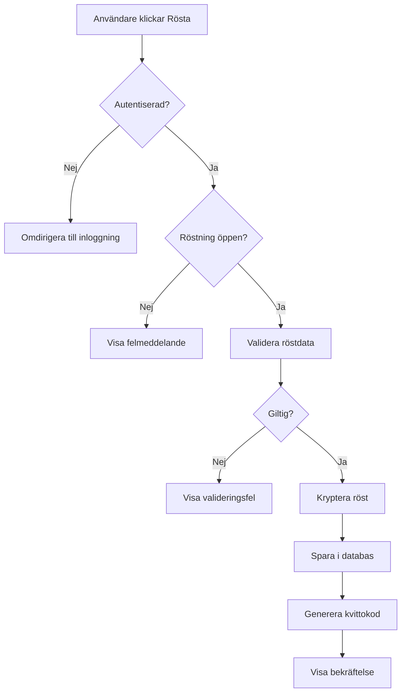

# Ändringslogg: Kravspecifikation

## 2024-02-28: Omstrukturering och utökning av krav

### Sammanfattning

Systemspecifikationen har omstrukturerats och utökats enligt användarens krav. Alla krav är nu uppdelade i separata filer för att göra det lättare att hitta information.

### Nya krav som lagts till

#### 1. Prestandakrav (PRESTANDA-OCH-TEKNISKA-KRAV.md)

**API-responstider:**

- Röstning: Max 50ms (utan kryptering), 150ms (med kryptering)
- Inloggning: Max 200ms
- Hämta dagordning: Max 100ms
- Resultatpresentation: Max 500ms för 500 röster

**Motivering:** Snabba API-svar är kritiska för användarupplevelsen. Animationer på klientsidan är sekundära.

**Belastningsscenarier:**

- Normal: 50 samtidiga användare
- Topp: 200 samtidiga användare
- Max: 500 samtidiga användare

#### 2. Säkerhetskrav för kod och bibliotek

**Minimera externa beroenden:**

- Kopiera funktioner istället för att importera hela bibliotek
- Tydlig attribution för kopierad kod (källa, licens, datum)
- ENDAST standardbibliotek för kryptering (ALDRIG egenutvecklade algoritmer)

**Exempel på attribution:**

```javascript
/**
 * Kopierad från: https://github.com/example/library/blob/main/src/utils.js
 * Licens: MIT License
 * Datum: 2024-01-15
 * Modifieringar: Ändrat felhantering
 */
```

**Öppen källkod och nyckelhantering:**

- Hela kodbasen är öppen
- Alla nycklar skapas/läggs in vid serverstart
- Inga hårdkodade hemligheter
- Miljövariabler och secrets management

#### 3. Testningskrav

**Kritisk kod (säkerhet och rättssäkerhet):**

- > 95% kodtäckning
- Enhetstester, integrationstester, säkerhetstester
- Formell verifiering (om möjligt)
- Minst två personer granskar all kritisk kod
- Defensiv säkerhet (input-validering, fail-safe, least privilege)

**Vanlig funktionalitet:**

- > 70% kodtäckning
- Grundläggande testning

**Exempel på defensiv kod:**

```javascript
// BRA: Validerar och hanterar fel
function castVote(userId, voteData) {
  if (!isValidUserId(userId)) {
    throw new ValidationError("Invalid user ID");
  }
  if (!isValidVoteData(voteData)) {
    throw new ValidationError("Invalid vote data");
  }
  if (!canUserVote(userId)) {
    auditLog.warn("Unauthorized vote attempt", { userId });
    throw new AuthorizationError("User not authorized to vote");
  }
  // ... kryptera och spara
}
```

#### 4. Dokumentationskrav

**Mermaid-diagram för alla kritiska funktioner:**

- Flödesdiagram (steg-för-steg)
- Arkitekturdiagram (komponenter och relationer)
- Sekvensdiagram (interaktion över tid)

**Exempel på flödesdiagram:**



#### 5. Detaljerat presentation och röstningsflöde

**Ordförandens kontroll:**

1. Klicka på dagordningspunkt → Visas på projektor och medlemmarnas enheter
2. Klicka "Visa dokument" → Dagordningspunkt flyttas till botten, dokument visas
3. Klicka "Nästa slide" → Bläddra genom dokument
4. Klicka "Öppna röstning" → Nedräkningstimer startar (30-120s, konfigurerbar)
5. Timer når 00:00 → Röstning stängs automatiskt
6. Systemet väntar 2 sekunder → För nätverksfördröjning
7. Dekryptering och rösträkning → Resultat presenteras

**Deltagarens gränssnitt:**

- Automatisk synkronisering med ordförandens vy
- Fri navigering i dokument (oberoende av ordföranden)
- Röstgränssnitt visas automatiskt när röstning öppnas
- Kan ändra röst fram till stängning
- Begära ordet med möjlighet att ångra
- Använda mobil som mikrofon (med ekokompensering)

**Sekreterarens gränssnitt:**

- Dynamiskt protokoll med automatisk generering
- Röstresultat förs in automatiskt
- Manuell komplettering (yrkanden, diskussion)
- Export som PDF eller Markdown

**Transparens:**

- Antal medlemmar (röstberättigade)
- Inloggade medlemmar
- Fysiskt närvarande
- Digitalt närvarande
- Eftersläntrare (uppdateras i realtid)

**Mötesregler:**

- Länk till mötesregler alltid synlig
- Tidsgränser för talartid
- Timer för talare

#### 6. Personas och funktioner

Alla 9 personas dokumenterade med fullständiga funktioner:

1. **Ordförande**
   - Före: Förhandsgranska dagordning, testa projektor-vy, granska närvarostatistik
   - Under: Öppna/stänga möte, navigera dagordning, presentera dokument, öppna/stänga röstning, hantera talarlista, pausa vid haveri
   - Efter: Granska protokoll, exportera data

2. **Sekreterare**
   - Före: Förbereda protokollmall, testa protokollverktyg
   - Under: Dokumentera diskussion, hantera närvarolista, komplettera autogenererade delar
   - Efter: Slutföra protokoll, exportera, arkivera

3. **Revisor**
   - Före: Granska systemkonfiguration, testa verifierbarhet
   - Under: Övervaka röstning, granska autentisering
   - Efter: Granska revisionsspår, verifiera röstresultat, skriva revisionsberättelse

4. **Ekonomiskt ansvarig (Kassör)**
   - Före: Ladda upp ekonomiska dokument, förbereda presentation
   - Under: Presentera ekonomi, svara på frågor, rösta
   - Efter: Arkivera beslut

5. **Deltagare/Medlem**
   - Före: Logga in, läsa handlingar, avge förtidsröst, ändra förtidsröst
   - Under: Följa mötet, delta i röstning, begära ordet, använda mobil som mikrofon, se resultat
   - Efter: Verifiera röster, läsa protokoll

6. **Valberedning**
   - Före: Lägga upp kandidater, hantera nomineringar, välja valmetod, förbereda presentation
   - Under: Presentera kandidater, övervaka personval, presentera resultat
   - Efter: Kontakta valda, arkivera

7. **Super admin/Teknisk ansvarig**
   - Före första användning: Installera systemet, konfigurera förening, sätta upp backup, konfigurera övervakning
   - Före varje möte: Verifiera systemhälsa, uppdatera system, förbereda support
   - Under mötet: Övervaka system, ge support, hantera tekniskt haveri
   - Efter mötet: Verifiera backup, analysera prestanda, dokumentera

8. **Mötessamordnare (Styrelserepresentant)**
   - Före: Skapa möte, bygg dagordning, ladda upp handlingar, aktivera förtidsröstning
   - Under: Övervaka mötet, stödja ordförande
   - Efter: Arkivera möte

9. **Valkommitté**
   - Före: Förbereda medlemslista, testa QR-kod-generering
   - Under: Registrera fysiskt närvarande, hantera väntande godkännanden, manuellt lägga till medlemmar, hantera tekniska problem, övervaka säkerhetsnivåer
   - Efter: Exportera röstlängd, dokumentera specialfall

### Nya filer skapade

#### Kravdokument (doc/krav/)

1. **FUNKTIONELLA-KRAV.md**
   - Röstningsprocess och tidslinje
   - Röstlängd och närvarodefinitioner
   - Valmetoder
   - Hantering av tekniskt haveri
   - Innehållshantering
   - White-label konfiguration

2. **PRESTANDA-OCH-TEKNISKA-KRAV.md**
   - API-responstider med krypteringspåverkan
   - Belastningsscenarier
   - Säkerhetskrav för kod och bibliotek
   - Testningskrav (kritisk vs vanlig kod)
   - Dokumentationskrav med Mermaid-diagram
   - Versionshantering och release-process

3. **SAKERHET-OCH-KRYPTERING.md**
   - Kryptografisk separation
   - Krypterad valurna
   - End-to-End Verifiability
   - Skydd mot påtryckningar
   - Hotmodellering (5 scenarier)
   - GDPR-compliance

4. **AUTENTISERING-OCH-MEDLEMSREGISTER.md**
   - Medlemsregister-integration (CSV, API, Directory Services, Hybrid)
   - Autentiseringsmetoder (Freja eID+, SSO, Magic Link, QR-kod, Användarnamn/Lösenord)
   - Hantering av specialfall (internationella medlemmar, sent betalda, nya medlemmar, tekniska problem, gästobservatörer)
   - Valkommitténs gränssnitt
   - Säkerhetsnivåer och badges

5. **INFRASTRUKTUR-OCH-HOSTING.md**
   - Portabilitet (Docker, Kubernetes)
   - WAF och DDoS-skydd
   - Hosting-alternativ (Laptop, VPS, Molntjänst, Kubernetes)
   - Databas (SQLite, PostgreSQL, MySQL)
   - Backup och disaster recovery
   - Övervakning och alerting
   - Skalning
   - Kostnadsuppskattning per hosting-typ

6. **PRESENTATION-OCH-ROSTNINGSFLODE.md**
   - Projektor-vy (ordförandens kontroll)
   - Dagordningspresentation (klick för punkt, klick för dokument, klick för slide)
   - Röstningsprocess (nedräkningstimer, 2s väntetid, dekryptering, resultatpresentation)
   - Deltagarvy (automatisk synkronisering, fri navigering, röstgränssnitt, begära ordet, mobil som mikrofon)
   - Sekreterarens gränssnitt (dynamiskt protokoll, automatisk generering, manuell komplettering)
   - Transparens och statusvisning (medlemsstatistik, röstningsstatistik, mötesregler)
   - Teknisk implementation (WebSocket, synkronisering, offline-funktionalitet, prestanda)

7. **PERSONAS-OCH-FUNKTIONER.md**
   - Alla 9 personas med fullständiga funktioner
   - Före, under och efter mötet
   - Teknisk kompetens per persona

8. **KOSTNADSUPPSKATTNING.md**
   - Mjukvarukostnad (0 kr)
   - Medlemsregister (0-300 kr/månad)
   - Autentisering (0 kr)
   - E-posttjänst (0-350 kr/månad)
   - Infrastruktur (0-900 kr/månad)
   - Sammanfattning per föreningstyp (liten, medelstor, stor, organisation med befintlig IT)
   - ROI-kalkyl och besparing jämfört med poströstning
   - Finansieringsalternativ

9. **ARBETSFLODE.md**
   - Fas 1: Plattformsuppsättning (installation, initial konfiguration)
   - Fas 2: Förberedelser inför årsmötet (skapa möte, bygg dagordning, ladda upp handlingar, lägg upp kandidater, aktivera förtidsröstning)
   - Fas 3: Förtidsröstning pågår (medlemmar loggar in, läser handlingar, avger förtidsröst, valkommittén hanterar specialfall)
   - Fas 4: Genomförande av årsmötet (förberedelser, mötet börjar, röstning, sekreterare kompletterar protokoll, mötet avslutas)
   - Fas 5: Efterarbete (protokoll och arkivering, backup och revision, utvärdering)
   - Kontinuerlig drift (underhåll, support, förbättringar)

10. **README.md** (i krav-mappen)
    - Översikt över alla kravdokument
    - Läsguide per målgrupp
    - Status och nästa steg

#### Övriga dokument (doc/)

1. **OVERSIKT.md**
   - Översikt och syfte
   - Kärnprinciper (inklusive prestanda och rättssäkerhet)
   - Dokumentstruktur med länkar
   - Snabbstart per målgrupp
   - Viktiga höjdpunkter
   - Nästa steg
   - Kontakt och bidrag

2. **README.md** (i doc-mappen)
   - Huvudindex för all dokumentation
   - Länkar till alla dokument
   - Snabbstart per målgrupp
   - Viktiga höjdpunkter
   - Status och nästa steg

3. **CHANGELOG-KRAV.md** (denna fil)
   - Sammanfattning av alla ändringar
   - Nya krav som lagts till
   - Nya filer skapade

### Förbättringar av befintliga krav

#### UI/UX-krav (UI-UX-KRAV.md)

Befintlig fil behålls med följande tillägg (redan dokumenterat):

- 13+ tema-mallar (från Corporate Blue till Retro Arcade)
- Playfulness-slider (1-10)
- Säsongsanpassade teman
- Detaljerade playfulness-effekter per nivå

#### Autentisering (AUTENTISERING-OCH-MEDLEMSREGISTER.md)

Befintlig fil behålls med följande tillägg:

- Säkerhetsnivå-badges (🔒🔒🔒 Mycket hög till ⚠️ Manuell)
- Säkerhetsöversikt-dashboard
- Varningar vid låg säkerhetsnivå

### Struktur

```
doc/
├── README.md                                    (Huvudindex)
├── OVERSIKT.md                                  (Snabbstart och översikt)
├── CHANGELOG-KRAV.md                            (Denna fil)
├── system-spec.md                               (Ursprunglig spec, behålls för referens)
├── UI-UX-KRAV.md                                (UI/UX-krav)
├── AUTENTISERING-OCH-MEDLEMSREGISTER.md         (Detaljerad autentisering)
├── PLAYFULNESS-OCH-TEMAN.md                     (Tema-mallar)
├── digital-motion.md                            (Antagen motion)
├── Mensa-Sverige-Stadgar-2024.pdf               (Stadgar svenska)
├── Mensa-Sweden-Bylaws-2024.pdf                 (Stadgar engelska)
└── krav/
    ├── README.md                                (Index för kravdokument)
    ├── FUNKTIONELLA-KRAV.md                     (Vad systemet ska göra)
    ├── PRESTANDA-OCH-TEKNISKA-KRAV.md           (Hur snabbt och säkert)
    ├── SAKERHET-OCH-KRYPTERING.md               (Säkerhetsmekanismer)
    ├── AUTENTISERING-OCH-MEDLEMSREGISTER.md     (Inloggning och verifiering)
    ├── INFRASTRUKTUR-OCH-HOSTING.md             (Teknisk infrastruktur)
    ├── PRESENTATION-OCH-ROSTNINGSFLODE.md       (Detaljerat flöde under mötet)
    ├── PERSONAS-OCH-FUNKTIONER.md               (Alla användarroller)
    ├── KOSTNADSUPPSKATTNING.md                  (Kostnader och ROI)
    └── ARBETSFLODE.md                           (Steg-för-steg-guide)
```

### Sammanfattning av nya krav

1. **Prestanda**: API-responstider specificerade (50-150ms för röstning)
2. **Säkerhet**: Minimera beroenden, kopiera funktioner, ENDAST standardbibliotek för kryptering
3. **Testning**: >95% kodtäckning för kritisk kod, defensiv säkerhet
4. **Dokumentation**: Mermaid-diagram för alla kritiska funktioner
5. **Presentation**: Detaljerat flöde med klick-för-klick-beskrivning
6. **Personas**: Alla 9 roller med fullständiga funktioner
7. **Transparens**: Realtidsstatistik för medlemmar, inloggade, fysiskt/digitalt närvarande
8. **Mötesregler**: Alltid synliga, tidsgränser för talartid

### Nästa steg

1. **GDPR-analys och DPIA**: Komplettera med fullständig dataskyddskonsekvensanalys
2. **API-specifikation**: Skapa OpenAPI/Swagger-dokumentation för alla endpoints
3. **Databasschema**: Designa tabeller, relationer och indexering
4. **Kryptografisk implementation**: Detaljera algoritmer, nyckelhantering och protokoll

### Kontakt

Om du har frågor eller förslag på förbättringar, kontakta projektledningen.

## 2024-02-28 (senare): Konsolidering av alla krav till krav-mappen

### Sammanfattning

Alla kravdokument har flyttats till `doc/krav/` för att samla all kravdokumentation på ett ställe.

### Ändringar

**Flyttade filer:**

- `doc/UI-UX-KRAV.md` → `doc/krav/UI-UX-KRAV.md`
- `doc/PLAYFULNESS-OCH-TEMAN.md` → `doc/krav/PLAYFULNESS-OCH-TEMAN.md`
- `doc/AUTENTISERING-OCH-MEDLEMSREGISTER.md` → `doc/krav/AUTENTISERING-OCH-MEDLEMSREGISTER-DETALJERAD.md`

**Uppdaterade filer:**

- `doc/krav/README.md` - Lagt till de nya filerna
- `doc/README.md` - Uppdaterat länkar till krav-mappen
- `doc/OVERSIKT.md` - Uppdaterat dokumentstruktur

**Resultat:**

- Alla 12 kravdokument finns nu i `doc/krav/`
- `doc/` innehåller endast översiktsfiler och referensdokument
- `doc/mensa/` innehåller stadgar och motioner (referensdokument)

### Ny struktur

```
doc/
├── README.md                    ← Huvudindex
├── OVERSIKT.md                  ← Snabbstart
├── CHANGELOG-KRAV.md            ← Ändringslogg
├── system-spec.md               ← Ursprunglig spec (referens)
├── mensa/                       ← Referensdokument
│   ├── digital-motion.md
│   ├── Mensa-Sverige-Stadgar-2024.pdf
│   ├── Mensa-Sweden-Bylaws-2024.pdf
│   └── Valbilaga_2025_webb.pdf
└── krav/                        ← ALLA KRAV FINNS HÄR
    ├── README.md
    ├── FUNKTIONELLA-KRAV.md
    ├── PRESTANDA-OCH-TEKNISKA-KRAV.md
    ├── SAKERHET-OCH-KRYPTERING.md
    ├── AUTENTISERING-OCH-MEDLEMSREGISTER.md
    ├── AUTENTISERING-OCH-MEDLEMSREGISTER-DETALJERAD.md
    ├── INFRASTRUKTUR-OCH-HOSTING.md
    ├── PRESENTATION-OCH-ROSTNINGSFLODE.md
    ├── PERSONAS-OCH-FUNKTIONER.md
    ├── KOSTNADSUPPSKATTNING.md
    ├── ARBETSFLODE.md
    ├── UI-UX-KRAV.md
    └── PLAYFULNESS-OCH-TEMAN.md
```

### Fördelar

1. **Enklare att hitta**: Alla krav finns på ett ställe
2. **Tydligare struktur**: Separation mellan krav och referensdokument
3. **Lättare att underhålla**: En mapp att fokusera på
4. **Bättre översikt**: `doc/krav/README.md` ger komplett översikt
