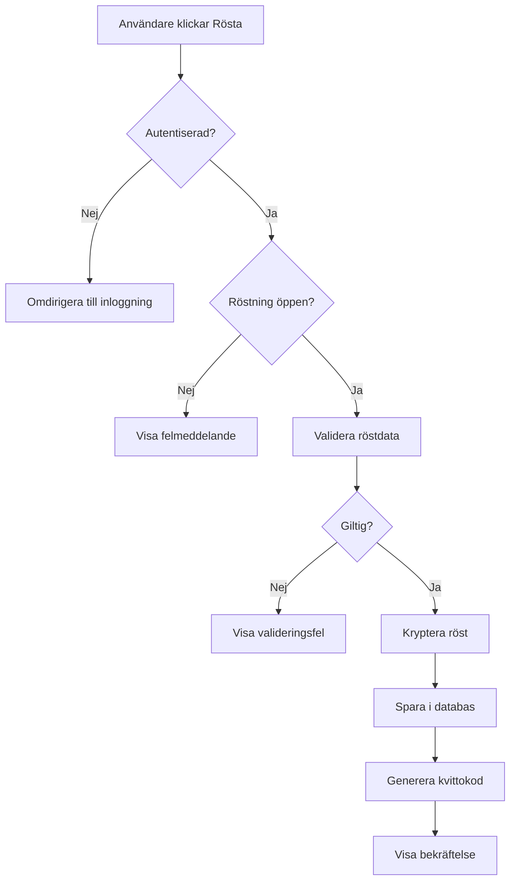
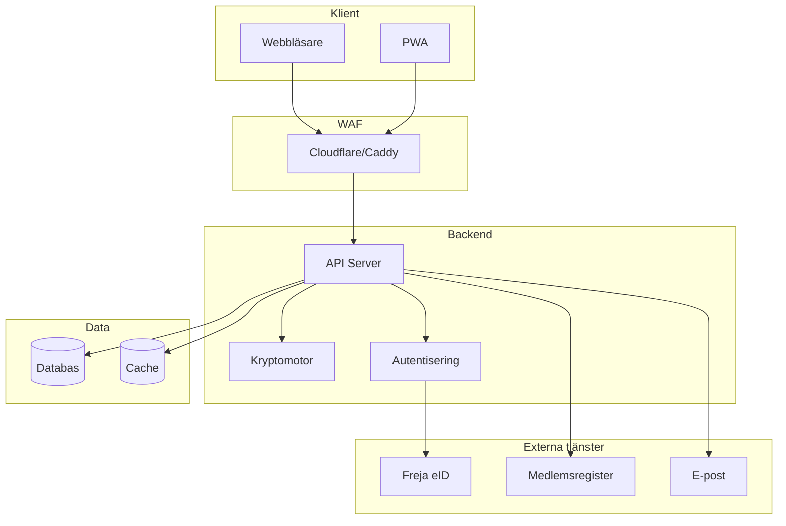
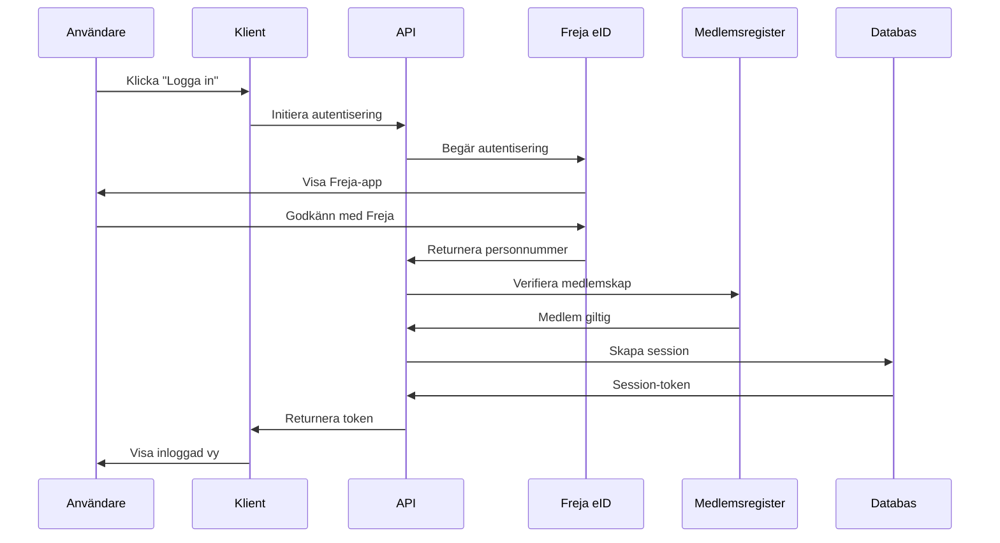

# Prestanda och Tekniska Krav

## 1. Prestandakrav

### 1.1 API-responstider

Alla API-anrop ska vara snabba för att ge en responsiv användarupplevelse. Animationer på klientsidan är sekundära - det är API-nivån som är kritisk.

#### 1.1.1 Målsatta responstider

- **Röstning (komplett transaktion)**: Max 50ms på vanlig mobil och laptop
  - Inkluderar: Validering, kryptering, databasinsättning, bekräftelse
  - Mäts från klientens request till mottagen bekräftelse
  - Gäller under normal belastning (< 100 samtidiga användare)

- **Inloggning och autentisering**: Max 200ms
  - Exkluderar externa tjänster (Freja eID, SSO)
  - Inkluderar: Sessionsskapande, tokenvalidering, databaskontroll

- **Hämta dagordning och dokument**: Max 100ms
  - För dokument < 1MB
  - Större dokument ska använda progressiv laddning

- **Resultatpresentation**: Max 500ms
  - Inkluderar: Dekryptering av valurna, rösträkning, formatering
  - Gäller för val med < 500 röster

#### 1.1.2 Krypteringspåverkan

Med tanke på krypteringskraven kan responstiderna behöva justeras:

- **Asymmetrisk kryptering (RSA-4096)**: +20-50ms per operation
- **Symmetrisk kryptering (AES-256)**: +5-10ms per operation
- **Blind signatures**: +30-100ms per röst

**Justerade målsättningar med kryptering:**

- **Röstning med full kryptering**: Max 150ms (50ms + 100ms krypto-overhead)
- **Dekryptering av valurna**: Max 2000ms för 500 röster (4ms per röst)

#### 1.1.3 Belastningsscenarier

Systemet ska klara följande belastning utan prestandaförsämring:

- **Normal belastning**: 50 samtidiga användare, < 10 requests/sekund
- **Toppbelastning (live-röstning)**: 200 samtidiga användare, < 50 requests/sekund
- **Maxbelastning**: 500 samtidiga användare, < 100 requests/sekund

Vid högre belastning accepteras:

- 2x längre responstider (300ms för röstning)
- Kösystem för att hantera överbelastning
- Tydlig feedback till användare om fördröjning

### 1.2 Databasprestanda

- **Indexering**: Alla frekvent använda frågor ska ha index
- **Transaktioner**: Röstning ska vara atomär (ACID-compliance)
- **Replikering**: Läsoperationer kan använda read replicas
- **Caching**: Statisk data (dagordning, dokument) ska cachas i minnet

### 1.3 Frontend-prestanda

- **Initial laddning**: Max 2 sekunder på 4G-nätverk
- **Time to Interactive (TTI)**: Max 3 sekunder
- **Lazy loading**: Dokument och bilder laddas progressivt
- **Offline-first**: Kritisk funktionalitet fungerar utan nätverk

### 1.4 Mätning och övervakning

- **Application Performance Monitoring (APM)**: Alla API-anrop loggas med responstid
- **Real User Monitoring (RUM)**: Mät faktisk användarupplevelse
- **Alerting**: Varning om responstider överstiger tröskelvärden
- **Dashboards**: Realtidsövervakning under mötet

## 2. Säkerhetskrav för Kod och Bibliotek

### 2.1 Minimera externa beroenden

För att minska attackytan ska systemet använda så få externa bibliotek som möjligt.

#### 2.1.1 Principer

- **Kopiera istället för att importera**: Om endast en funktion behövs från ett bibliotek, kopiera funktionen istället
- **Tydlig attribution**: All kopierad kod ska ha kommentar med:
  - Ursprunglig källa (URL till repository)
  - Licens (MIT, Apache 2.0, etc.)
  - Datum för kopiering
  - Eventuella modifieringar

**Exempel:**

```javascript
/**
 * Kopierad från: https://github.com/example/library/blob/main/src/utils.js
 * Licens: MIT License
 * Datum: 2024-01-15
 * Modifieringar: Ändrat felhantering för att matcha vårt system
 */
function sanitizeInput(input) {
  // ... kopierad kod ...
}
```

#### 2.1.2 Godkända bibliotek

Endast följande typer av bibliotek får användas utan extra granskning:

- **Kryptografi**: ENDAST standardbibliotek från språkets ekosystem
  - Node.js: `crypto` (inbyggd)
  - Python: `cryptography`, `pycryptodome`
  - Go: `crypto/*` (standard library)
  - **ALDRIG** egenutvecklade kryptoalgoritmer eller okända bibliotek

- **Ramverk**: Välkända och väl granskade ramverk
  - Frontend: React, Vue, Svelte (välj ett)
  - Backend: Express, Fastify, Flask, FastAPI, Gin (välj ett)
  - Databas: PostgreSQL, MySQL (välj ett)

- **Säkerhet**: Välkända säkerhetsbibliotek
  - Helmet.js (HTTP-headers)
  - CORS-middleware
  - Rate limiting (express-rate-limit, etc.)

#### 2.1.3 Biblioteksgranskning

Alla externa bibliotek ska granskas enligt följande kriterier:

1. **Popularitet**: > 1000 GitHub-stjärnor eller > 100k nedladdningar/vecka
2. **Underhåll**: Aktivt underhållet (commit senaste 6 månaderna)
3. **Säkerhet**: Inga kända kritiska sårbarheter (CVE-databas)
4. **Licens**: Kompatibel med AGPLv3 eller MIT (projektets licens)
5. **Kodgranskning**: Manuell granskning av källkod för kritiska bibliotek

**Dokumentation:**

- Alla godkända bibliotek ska listas i `DEPENDENCIES.md`
- Inkludera: Namn, version, licens, syfte, granskningsdatum
- Uppdatera vid varje ny version

### 2.2 Öppen källkod och nyckelhantering

#### 2.2.1 Hela kodbasen är öppen

- All kod ska vara publik på GitHub/GitLab
- Inga hårdkodade hemligheter i koden
- Alla konfigurationsfiler ska vara mallar (`.example`)

#### 2.2.2 Nyckelhantering

Alla nycklar och hemligheter skapas/läggs in vid serverstart:

- **Miljövariabler**: Använd `.env`-filer (ej versionshanterade)
- **Secrets management**: Stöd för Docker Secrets, Kubernetes Secrets, HashiCorp Vault
- **Rotation**: Nycklar ska kunna roteras utan kodändringar
- **Generering**: Automatisk generering av nycklar vid första start (om ej angivna)

**Exempel på nycklar som behövs:**

- Databas-lösenord
- JWT-signeringsnyckel
- Krypteringsnycklar för valurna
- API-nycklar för externa tjänster (Freja eID, e-post, etc.)

#### 2.2.3 Säker konfiguration

- **Standardvärden**: Säkra standardvärden (Security by Default)
- **Validering**: Alla konfigurationsvärden valideras vid start
- **Dokumentation**: Tydlig dokumentation för alla konfigurationsalternativ

## 3. Testning och Kvalitetssäkring

### 3.1 Kritisk kod - Noggrann testning

All kod som påverkar säkerhet och rättssäkerhet ska testas och granskas noggrant.

#### 3.1.1 Definition av kritisk kod

- **Autentisering och auktorisering**: Inloggning, sessionhantering, behörighetskontroll
- **Kryptering**: Valurna, blind signatures, nyckelhantering
- **Röstning**: Röstlagring, röständring, rösträkning
- **Resultatpresentation**: Dekryptering, aggregering, visning
- **Revisionsspår**: Loggning, spårbarhet, anonymitet

#### 3.1.2 Testkrav för kritisk kod

- **Enhetstester (Unit tests)**: > 95% kodtäckning
- **Integrationstester**: Alla kritiska flöden testade
- **Säkerhetstester**: Penetrationstestning, fuzzing, statisk analys
- **Formell verifiering**: Matematisk bevisning av kryptografiska egenskaper (om möjligt)
- **Manuell kodgranskning**: Minst två personer granskar all kritisk kod

#### 3.1.3 Defensiv säkerhet

All kritisk kod ska skrivas med defensivt säkerhetstänk:

- **Input-validering**: Alla indata valideras och saniteras
- **Fail-safe**: Systemet ska misslyckas säkert (deny by default)
- **Least privilege**: Minimal behörighet för alla komponenter
- **Defense in depth**: Flera lager av säkerhet
- **Audit logging**: All kritisk aktivitet loggas

**Exempel på defensiv kod:**

```javascript
// DÅLIGT: Antar att input är giltig
function castVote(userId, voteData) {
  db.insert("votes", { user_id: userId, vote: voteData });
}

// BRA: Validerar och hanterar fel
function castVote(userId, voteData) {
  // Validera input
  if (!isValidUserId(userId)) {
    throw new ValidationError("Invalid user ID");
  }
  if (!isValidVoteData(voteData)) {
    throw new ValidationError("Invalid vote data");
  }

  // Kontrollera behörighet
  if (!canUserVote(userId)) {
    auditLog.warn("Unauthorized vote attempt", { userId });
    throw new AuthorizationError("User not authorized to vote");
  }

  // Kryptera röst
  const encryptedVote = encryptVote(voteData);

  // Spara i transaktion
  try {
    db.transaction(() => {
      db.insert("votes", { user_id: userId, vote: encryptedVote });
      auditLog.info("Vote cast successfully", { userId });
    });
  } catch (error) {
    auditLog.error("Failed to cast vote", { userId, error });
    throw new DatabaseError("Failed to save vote");
  }
}
```

### 3.2 Vanlig funktionalitet - Enklare testning

Kod som inte påverkar säkerhet kan testas enklare:

- **Enhetstester**: > 70% kodtäckning
- **Integrationstester**: Kritiska flöden testade
- **Manuell testning**: Grundläggande funktionalitet verifierad

**Exempel på vanlig funktionalitet:**

- UI-komponenter (knappar, formulär, etc.)
- Dokumentvisning
- Formatering av text
- Sortering och filtrering av listor

### 3.3 Testautomatisering

- **CI/CD**: Alla tester körs automatiskt vid varje commit
- **Pre-commit hooks**: Linting och formatering körs före commit
- **Nightly builds**: Fullständig testsvit körs varje natt
- **Performance tests**: Belastningstester körs regelbundet

### 3.4 Testdokumentation

- **Testplan**: Dokumentera vad som ska testas och hur
- **Testfall**: Detaljerade testfall för all kritisk funktionalitet
- **Testresultat**: Dokumentera resultat från alla tester
- **Buggar**: Spåra och dokumentera alla buggar och fixes

## 4. Dokumentation

### 4.1 Kodkommentarer

- **Kritisk kod**: Varje funktion ska ha detaljerad kommentar
- **Komplex logik**: Förklara varför, inte bara vad
- **Säkerhetsöverväganden**: Dokumentera säkerhetsbeslut

### 4.2 Arkitekturdokumentation

- **Översikt**: High-level arkitekturdiagram
- **Komponentdiagram**: Detaljerade diagram för varje komponent
- **Sekvensdiagram**: Flöden för kritiska operationer
- **Dataflödesdiagram**: Hur data flödar genom systemet

### 4.3 Mermaid-diagram för kritiska funktioner

Alla kritiska funktioner ska ha tydliga Mermaid-diagram:

#### 4.3.1 Flödesdiagram

Visar steg-för-steg-flöde för en operation.

**Exempel: Röstningsflöde**



#### 4.3.2 Arkitekturdiagram

Visar systemkomponenter och deras relationer.

**Exempel: Systemarkitektur**



#### 4.3.3 Sekvensdiagram

Visar interaktion mellan komponenter över tid.

**Exempel: Autentiseringssekvens**



### 4.4 API-dokumentation

- **OpenAPI/Swagger**: Alla endpoints dokumenterade
- **Exempel**: Request/response-exempel för varje endpoint
- **Felkoder**: Dokumentera alla möjliga felkoder
- **Autentisering**: Tydlig beskrivning av autentiseringsmetoder

### 4.5 Användarmanual

- **Installationsguide**: Steg-för-steg för olika miljöer
- **Konfigurationsguide**: Alla konfigurationsalternativ förklarade
- **Användarguide**: För varje användarroll (ordförande, medlem, etc.)
- **Felsökningsguide**: Vanliga problem och lösningar

### 4.6 Säkerhetsdokumentation

- **Hotmodell**: Dokumentera identifierade hot och motåtgärder
- **Säkerhetsarkitektur**: Beskriv säkerhetsmekanismer
- **Incidenthantering**: Procedurer vid säkerhetsincident
- **Penetrationstestrapporter**: Resultat från säkerhetstester

## 5. Versionshantering och Release

### 5.1 Semantic Versioning

- **MAJOR**: Brytande ändringar (1.0.0 → 2.0.0)
- **MINOR**: Nya funktioner, bakåtkompatibla (1.0.0 → 1.1.0)
- **PATCH**: Buggfixar, bakåtkompatibla (1.0.0 → 1.0.1)

### 5.2 Changelog

- **CHANGELOG.md**: Dokumentera alla ändringar per version
- **Format**: Keep a Changelog-standard
- **Kategorier**: Added, Changed, Deprecated, Removed, Fixed, Security

### 5.3 Release-process

1. **Kodgranskning**: All kod granskad av minst två personer
2. **Testning**: Alla tester passerade
3. **Dokumentation**: Uppdaterad för nya funktioner
4. **Changelog**: Uppdaterad med alla ändringar
5. **Taggning**: Git-tagg med versionsnummer
6. **Release notes**: Publicera release notes på GitHub
7. **Deployment**: Automatisk deployment till staging, manuell till produktion

### 5.4 Säkerhetsuppdateringar

- **Kritiska sårbarheter**: Patcha inom 24 timmar
- **Höga sårbarheter**: Patcha inom 7 dagar
- **Medel/låga sårbarheter**: Patcha inom 30 dagar
- **Kommunikation**: Informera användare om säkerhetsuppdateringar
