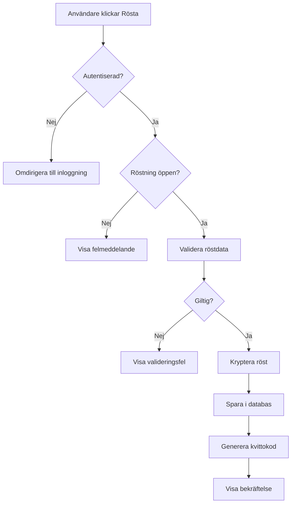
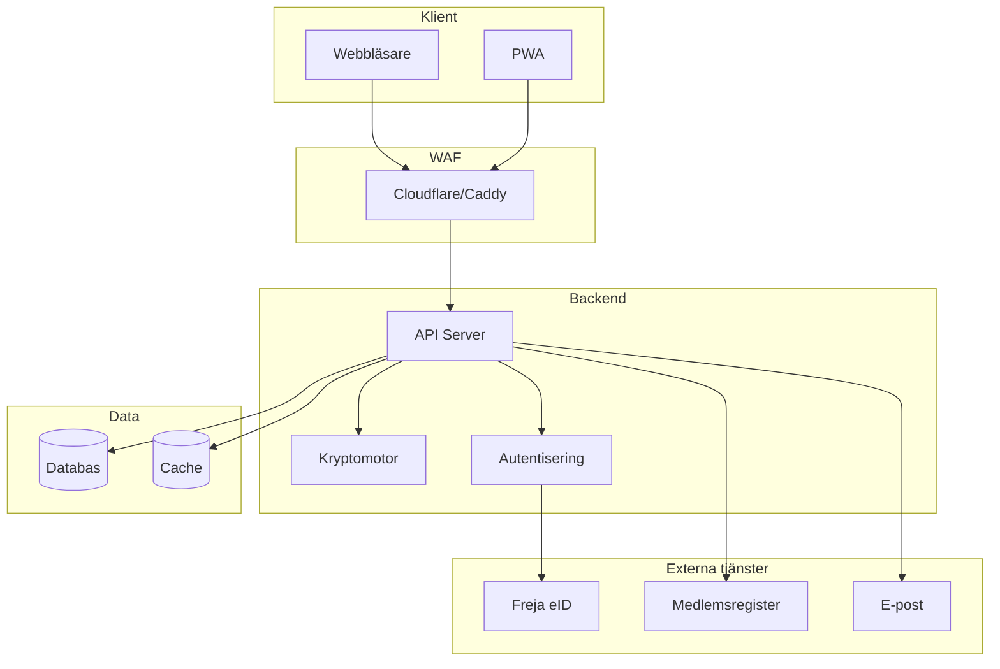
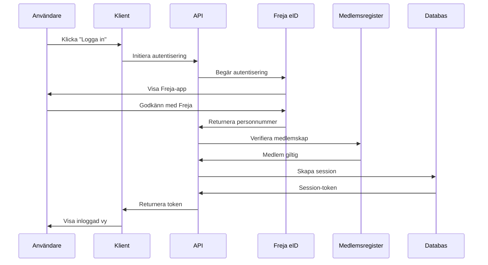

# Prestanda och Tekniska Krav

## 1. Prestandakrav

### 1.1 API-responstider

Alla API-anrop ska vara snabba för att ge en responsiv användarupplevelse. Animationer på klientsidan är sekundära - det är API-nivån som är kritisk.

#### 1.1.1 Målsatta responstider

- **Röstning (komplett transaktion)**: Max 50ms på vanlig mobil och laptop
  - Inkluderar: Validering, kryptering, databasinsättning, bekräftelse
  - Mäts från klientens request till mottagen bekräftelse
  - Gäller under normal belastning (< 100 samtidiga användare)

- **Inloggning och autentisering**: Max 200ms
  - Exkluderar externa tjänster (Freja eID, SSO)
  - Inkluderar: Sessionsskapande, tokenvalidering, databaskontroll

- **Hämta dagordning och dokument**: Max 100ms
  - För dokument < 1MB
  - Större dokument ska använda progressiv laddning

- **Resultatpresentation**: Max 500ms
  - Inkluderar: Dekryptering av valurna, rösträkning, formatering
  - Gäller för val med < 500 röster

#### 1.1.2 Krypteringspåverkan

Med tanke på krypteringskraven kan responstiderna behöva justeras:

- **Asymmetrisk kryptering (RSA-4096)**: +20-50ms per operation
- **Symmetrisk kryptering (AES-256)**: +5-10ms per operation
- **Blind signatures**: +30-100ms per röst

**Justerade målsättningar med kryptering:**

- **Röstning med full kryptering**: Max 150ms (50ms + 100ms krypto-overhead)
- **Dekryptering av valurna**: Max 2000ms för 500 röster (4ms per röst)

#### 1.1.3 Belastningsscenarier

Systemet ska klara följande belastning utan prestandaförsämring:

- **Normal belastning**: 50 samtidiga användare, < 10 requests/sekund
- **Toppbelastning (live-röstning)**: 200 samtidiga användare, < 50 requests/sekund
- **Maxbelastning**: 500 samtidiga användare, < 100 requests/sekund

Vid högre belastning accepteras:

- 2x längre responstider (300ms för röstning)
- Kösystem för att hantera överbelastning
- Tydlig feedback till användare om fördröjning

### 1.2 Databasprestanda

- **Indexering**: Alla frekvent använda frågor ska ha index
- **Transaktioner**: Röstning ska vara atomär (ACID-compliance)
- **Replikering**: Läsoperationer kan använda read replicas
- **Caching**: Statisk data (dagordning, dokument) ska cachas i minnet

### 1.3 Frontend-prestanda

- **Initial laddning**: Max 2 sekunder på 4G-nätverk
- **Time to Interactive (TTI)**: Max 3 sekunder
- **Lazy loading**: Dokument och bilder laddas progressivt
- **Offline-first**: Kritisk funktionalitet fungerar utan nätverk

### 1.4 Mätning och övervakning

- **Application Performance Monitoring (APM)**: Alla API-anrop loggas med responstid
- **Real User Monitoring (RUM)**: Mät faktisk användarupplevelse
- **Alerting**: Varning om responstider överstiger tröskelvärden
- **Dashboards**: Realtidsövervakning under mötet

## 2. Säkerhetskrav för Kod och Bibliotek

### 2.1 Minimera externa beroenden

För att minska attackytan ska systemet använda så få externa bibliotek som möjligt.

#### 2.1.1 Principer

- **Kopiera istället för att importera**: Om endast en funktion behövs från ett bibliotek, kopiera funktionen istället
- **Tydlig attribution**: All kopierad kod ska ha kommentar med:
  - Ursprunglig källa (URL till repository)
  - Licens (MIT, Apache 2.0, etc.)
  - Datum för kopiering
  - Eventuella modifieringar

**Exempel:**

```javascript
/**
 * Kopierad från: https://github.com/example/library/blob/main/src/utils.js
 * Licens: MIT License
 * Datum: 2024-01-15
 * Modifieringar: Ändrat felhantering för att matcha vårt system
 */
function sanitizeInput(input) {
  // ... kopierad kod ...
}
```

#### 2.1.2 Godkända bibliotek

Endast följande typer av bibliotek får användas utan extra granskning:

- **Kryptografi**: ENDAST standardbibliotek från språkets ekosystem
  - Node.js: `crypto` (inbyggd)
  - Python: `cryptography`, `pycryptodome`
  - Go: `crypto/*` (standard library)
  - **ALDRIG** egenutvecklade kryptoalgoritmer eller okända bibliotek

- **Ramverk**: Välkända och väl granskade ramverk
  - Frontend: React, Vue, Svelte (välj ett)
  - Backend: Express, Fastify, Flask, FastAPI, Gin (välj ett)
  - Databas: PostgreSQL, MySQL (välj ett)

- **Säkerhet**: Välkända säkerhetsbibliotek
  - Helmet.js (HTTP-headers)
  - CORS-middleware
  - Rate limiting (express-rate-limit, etc.)

#### 2.1.3 Biblioteksgranskning

Alla externa bibliotek ska granskas enligt följande kriterier:

1. **Popularitet**: > 1000 GitHub-stjärnor eller > 100k nedladdningar/vecka
2. **Underhåll**: Aktivt underhållet (commit senaste 6 månaderna)
3. **Säkerhet**: Inga kända kritiska sårbarheter (CVE-databas)
4. **Licens**: Kompatibel med AGPLv3 eller MIT (projektets licens)
5. **Kodgranskning**: Manuell granskning av källkod för kritiska bibliotek

**Dokumentation:**

- Alla godkända bibliotek ska listas i `DEPENDENCIES.md`
- Inkludera: Namn, version, licens, syfte, granskningsdatum
- Uppdatera vid varje ny version

### 2.2 Öppen källkod och nyckelhantering

#### 2.2.1 Hela kodbasen är öppen

- All kod ska vara publik på GitHub/GitLab
- Inga hårdkodade hemligheter i koden
- Alla konfigurationsfiler ska vara mallar (`.example`)

#### 2.2.2 Nyckelhantering

Alla nycklar och hemligheter skapas/läggs in vid serverstart:

- **Miljövariabler**: Använd `.env`-filer (ej versionshanterade)
- **Secrets management**: Stöd för Docker Secrets, Kubernetes Secrets, HashiCorp Vault
- **Rotation**: Nycklar ska kunna roteras utan kodändringar
- **Generering**: Automatisk generering av nycklar vid första start (om ej angivna)

**Exempel på nycklar som behövs:**

- Databas-lösenord
- JWT-signeringsnyckel
- Krypteringsnycklar för valurna
- API-nycklar för externa tjänster (Freja eID, e-post, etc.)

#### 2.2.3 Säker konfiguration

- **Standardvärden**: Säkra standardvärden (Security by Default)
- **Validering**: Alla konfigurationsvärden valideras vid start
- **Dokumentation**: Tydlig dokumentation för alla konfigurationsalternativ

## 3. Testning och Kvalitetssäkring

### 3.1 Kritisk kod - Noggrann testning

All kod som påverkar säkerhet och rättssäkerhet ska testas och granskas noggrant.

#### 3.1.1 Definition av kritisk kod

- **Autentisering och auktorisering**: Inloggning, sessionhantering, behörighetskontroll
- **Kryptering**: Valurna, blind signatures, nyckelhantering
- **Röstning**: Röstlagring, röständring, rösträkning
- **Resultatpresentation**: Dekryptering, aggregering, visning
- **Revisionsspår**: Loggning, spårbarhet, anonymitet

#### 3.1.2 Testkrav för kritisk kod

- **Enhetstester (Unit tests)**: > 95% kodtäckning
- **Integrationstester**: Alla kritiska flöden testade
- **Säkerhetstester**: Penetrationstestning, fuzzing, statisk analys
- **Formell verifiering**: Matematisk bevisning av kryptografiska egenskaper (om möjligt)
- **Manuell kodgranskning**: Minst två personer granskar all kritisk kod

#### 3.1.3 Defensiv säkerhet

All kritisk kod ska skrivas med defensivt säkerhetstänk:

- **Input-validering**: Alla indata valideras och saniteras
- **Fail-safe**: Systemet ska misslyckas säkert (deny by default)
- **Least privilege**: Minimal behörighet för alla komponenter
- **Defense in depth**: Flera lager av säkerhet
- **Audit logging**: All kritisk aktivitet loggas

**Exempel på defensiv kod:**

```javascript
// DÅLIGT: Antar att input är giltig
function castVote(userId, voteData) {
  db.insert("votes", { user_id: userId, vote: voteData });
}

// BRA: Validerar och hanterar fel
function castVote(userId, voteData) {
  // Validera input
  if (!isValidUserId(userId)) {
    throw new ValidationError("Invalid user ID");
  }
  if (!isValidVoteData(voteData)) {
    throw new ValidationError("Invalid vote data");
  }

  // Kontrollera behörighet
  if (!canUserVote(userId)) {
    auditLog.warn("Unauthorized vote attempt", { userId });
    throw new AuthorizationError("User not authorized to vote");
  }

  // Kryptera röst
  const encryptedVote = encryptVote(voteData);

  // Spara i transaktion
  try {
    db.transaction(() => {
      db.insert("votes", { user_id: userId, vote: encryptedVote });
      auditLog.info("Vote cast successfully", { userId });
    });
  } catch (error) {
    auditLog.error("Failed to cast vote", { userId, error });
    throw new DatabaseError("Failed to save vote");
  }
}
```

### 3.2 Vanlig funktionalitet - Enklare testning

Kod som inte påverkar säkerhet kan testas enklare:

- **Enhetstester**: > 70% kodtäckning
- **Integrationstester**: Kritiska flöden testade
- **Manuell testning**: Grundläggande funktionalitet verifierad

**Exempel på vanlig funktionalitet:**

- UI-komponenter (knappar, formulär, etc.)
- Dokumentvisning
- Formatering av text
- Sortering och filtrering av listor

### 3.3 Testautomatisering

- **CI/CD**: Alla tester körs automatiskt vid varje commit
- **Pre-commit hooks**: Linting och formatering körs före commit
- **Nightly builds**: Fullständig testsvit körs varje natt
- **Performance tests**: Belastningstester körs regelbundet

### 3.4 Testdokumentation

- **Testplan**: Dokumentera vad som ska testas och hur
- **Testfall**: Detaljerade testfall för all kritisk funktionalitet
- **Testresultat**: Dokumentera resultat från alla tester
- **Buggar**: Spåra och dokumentera alla buggar och fixes

## 4. Dokumentation

### 4.1 Kodkommentarer

- **Kritisk kod**: Varje funktion ska ha detaljerad kommentar
- **Komplex logik**: Förklara varför, inte bara vad
- **Säkerhetsöverväganden**: Dokumentera säkerhetsbeslut

### 4.2 Arkitekturdokumentation

- **Översikt**: High-level arkitekturdiagram
- **Komponentdiagram**: Detaljerade diagram för varje komponent
- **Sekvensdiagram**: Flöden för kritiska operationer
- **Dataflödesdiagram**: Hur data flödar genom systemet

### 4.3 Mermaid-diagram för kritiska funktioner

Alla kritiska funktioner ska ha tydliga Mermaid-diagram:

#### 4.3.1 Flödesdiagram

Visar steg-för-steg-flöde för en operation.

**Exempel: Röstningsflöde**



#### 4.3.2 Arkitekturdiagram

Visar systemkomponenter och deras relationer.

**Exempel: Systemarkitektur**



#### 4.3.3 Sekvensdiagram

Visar interaktion mellan komponenter över tid.

**Exempel: Autentiseringssekvens**



### 4.4 API-dokumentation

- **OpenAPI/Swagger**: Alla endpoints dokumenterade
- **Exempel**: Request/response-exempel för varje endpoint
- **Felkoder**: Dokumentera alla möjliga felkoder
- **Autentisering**: Tydlig beskrivning av autentiseringsmetoder

### 4.5 Användarmanual

- **Installationsguide**: Steg-för-steg för olika miljöer
- **Konfigurationsguide**: Alla konfigurationsalternativ förklarade
- **Användarguide**: För varje användarroll (ordförande, medlem, etc.)
- **Felsökningsguide**: Vanliga problem och lösningar

### 4.6 Säkerhetsdokumentation

- **Hotmodell**: Dokumentera identifierade hot och motåtgärder
- **Säkerhetsarkitektur**: Beskriv säkerhetsmekanismer
- **Incidenthantering**: Procedurer vid säkerhetsincident
- **Penetrationstestrapporter**: Resultat från säkerhetstester

## 5. Versionshantering och Release

### 5.1 Semantic Versioning

- **MAJOR**: Brytande ändringar (1.0.0 → 2.0.0)
- **MINOR**: Nya funktioner, bakåtkompatibla (1.0.0 → 1.1.0)
- **PATCH**: Buggfixar, bakåtkompatibla (1.0.0 → 1.0.1)

### 5.2 Changelog

- **CHANGELOG.md**: Dokumentera alla ändringar per version
- **Format**: Keep a Changelog-standard
- **Kategorier**: Added, Changed, Deprecated, Removed, Fixed, Security

### 5.3 Release-process

1. **Kodgranskning**: All kod granskad av minst två personer
2. **Testning**: Alla tester passerade
3. **Dokumentation**: Uppdaterad för nya funktioner
4. **Changelog**: Uppdaterad med alla ändringar
5. **Taggning**: Git-tagg med versionsnummer
6. **Release notes**: Publicera release notes på GitHub
7. **Deployment**: Automatisk deployment till staging, manuell till produktion

### 5.4 Säkerhetsuppdateringar

- **Kritiska sårbarheter**: Patcha inom 24 timmar
- **Höga sårbarheter**: Patcha inom 7 dagar
- **Medel/låga sårbarheter**: Patcha inom 30 dagar
- **Kommunikation**: Informera användare om säkerhetsuppdateringar

## 6. Loggning och revisionsspår

### 6.1 Loggningens omfattning

Systemet ska logga tillräckligt för rättssäkerhet men inte överdriven (de flesta föreningar är små):

- **Autentiseringar**: Alla lyckade och misslyckade inloggningar
- **Administrative ändringar**: Vem, vad, när (t.ex. ändring av dagordning, konfiguration)
- **Röstningar**: Antal röster per fråga (men INTE vem som röstat på vad)
- **Systemfel och varningar**: Alla fel och varningar
- **Åtkomst till känsliga data**: Åtkomst till medlemsregister, loggar
- **Ändringar i konfiguration**: Alla ändringar i systemkonfiguration

### 6.2 Loggars integritet

- **Append-only**: Loggar ska skrivas till append-only-struktur (kan inte ändras eller raderas)
- **Kryptografisk kedja**: Varje loggpost innehåller hash av föregående post
- **Export**: Loggar ska kunna exporteras till extern lagring (t.ex. som del av protokollet)
- **Verifiering**: Möjlighet att verifiera loggars integritet genom att kontrollera kedjan

### 6.3 Loggformat

- **Strukturerat format**: JSON eller annat strukturerat format
- **Tidsstämpel**: Varje loggpost har exakt tidsstämpel (ISO 8601)
- **Nivå**: ERROR, WARN, INFO, DEBUG
- **Kontext**: Användare, IP-adress, session-ID (där tillämpligt)
- **Meddelande**: Tydligt meddelande om vad som hände

**Exempel:**

```json
{
  "timestamp": "2025-05-31T10:15:32.123Z",
  "level": "INFO",
  "event": "VOTE_CAST",
  "user_id": "hashed_user_id",
  "question_id": "q_001",
  "ip_address": "192.168.1.100",
  "session_id": "sess_abc123",
  "message": "Vote cast successfully",
  "previous_hash": "sha256_of_previous_log"
}
```

### 6.4 Loggars tillgänglighet

- **Bevarande**: Loggar bevaras enligt föreningens stadgar (ofta tillsammans med protokollet)
- **Sökbarhet**: Loggar ska vara sökbara och filterbara
- **Export**: Export i standardformat (JSON, CSV)
- **Anonymisering**: Personuppgifter anonymiseras efter mötet (enligt GDPR, med undantag för arkivlagen)

### 6.5 Granskning av loggar

- **Automatisk övervakning**: Automatisk övervakning av ovanliga händelser
  - Många misslyckade inloggningar (> 5 från samma IP på 5 minuter)
  - Åtkomst till känsliga data utanför mötet
  - Systemfel under mötet
- **Revisorns tillgång**: Revisor har tillgång till alla loggar
- **Dokumentation**: Granskningsresultat dokumenteras i revisionsberättelsen

## 7. Systemets livscykel och drift

### 7.1 Kortvarig drift

Systemet körs normalt bara under kort tid:

- **Före mötet**: Förberedelser och förtidsröstning (enligt föreningens stadgar)
- **Under mötet**: Själva mötet (vanligtvis 4-8 timmar)
- **Efter mötet**: Protokolljustering och arkivering (vanligtvis 1-2 veckor)
- **Total drifttid per år**: Varierar beroende på förening

### 7.2 Konsekvenser för design

#### 7.2.1 Installation och uppsättning

- **Enkel installation**: Docker-container eller enkel binär
- **Snabb uppsättning**: Wizard för uppsättning ska ta < 30 minuter
- **Minimal konfiguration**: Så lite konfiguration som möjligt
- **Testning**: Inbyggd testfunktion för att verifiera att allt fungerar

#### 7.2.2 Backup och återställning

- **Datadump viktigare än kontinuerlig backup**: Fokus på datadump för att kunna flytta till ny dator
- **Snabb återställning**: Återställning från datadump ska ta < 5 minuter
- **Systemkod på GitHub**: Systemkoden behöver inte backas upp
- **Protokoll är artefakten**: Protokollet med bilagor är den enda långsiktiga artefakten

#### 7.2.3 Underhåll

- **Säkerhetsuppdateringar**: Kritiska uppdateringar ska installeras före mötet
- **Testning**: Systemet ska testas 2 veckor före mötet
- **Support**: Support ska finnas tillgänglig under mötet
- **Dokumentation**: Tydlig dokumentation för felsökning

### 7.3 Driftsäkerhet under mötet

- **Övervakning**: Realtidsövervakning av systemhälsa under mötet
- **Alerting**: Automatiska varningar vid problem
- **Fallback**: Manuell röstning som reserv vid tekniskt haveri
- **Kommunikation**: Tydlig kommunikation till deltagare vid problem

## 8. Dataskydd och GDPR

### 8.1 Personuppgiftshantering

- **Minimal datainsamling**: Endast nödvändiga uppgifter samlas in
- **Tydligt syfte**: Varje datapunkt har ett dokumenterat syfte
- **Lagringstid**: Data raderas efter mötet (med undantag för arkivlagen)
- **Användarrättigheter**: Medlemmar kan begära ut sina uppgifter

### 8.2 Arkivlagen och GDPR

- **Arkivlagen åsidosätter GDPR**: Arkivlagen för mötesdeltagare åsidosätter vissa GDPR-krav
- **Protokoll måste bevaras**: Protokoll med röstlängd måste bevaras enligt arkivlagen
- **Anonymisering där möjligt**: Personuppgifter anonymiseras där det är möjligt
- **Tydlig information**: Medlemmar informeras om hur deras uppgifter hanteras

### 8.3 Dataskyddskonsekvensanalys (DPIA)

- **Obligatorisk**: DPIA måste genomföras innan systemet tas i drift
- **Dokumentation**: Alla risker och åtgärder dokumenteras
- **Uppdatering**: DPIA uppdateras vid större ändringar
- **Tillgänglig**: DPIA ska vara tillgänglig för medlemmar

### 8.4 Radering av data

- **Efter mötet**: Medlemsinformation raderas efter årsmötet eller kort tid därefter
- **Undantag**: Protokoll med röstlängd bevaras enligt arkivlagen
- **Loggar**: Loggar anonymiseras efter mötet
- **Bekräftelse**: Medlemmar kan begära bekräftelse på att deras data raderats

## 9. Dokumentation för föreningar

### 9.1 Användarguider

- **Rollspecifika guider**: Guide för varje roll (ordförande, sekreterare, etc.)
- **Steg-för-steg**: Tydliga steg-för-steg-instruktioner
- **Skärmdumpar**: Skärmdumpar för att illustrera
- **Video-tutorials**: Korta video-tutorials (2-5 minuter)

### 9.2 Teknisk dokumentation

- **Installation**: Tydlig installationsguide
- **Konfiguration**: Dokumentation av alla konfigurationsalternativ
- **Felsökning**: Vanliga problem och lösningar
- **API-dokumentation**: Om systemet har API för integration

### 9.3 Juridisk dokumentation

- **Valfusk**: Definition, rapportering, utredning, sanktioner
- **Omprövning av beslut**: Process, tidsgränser, beslutsfattare
- **Rättslig prövning**: Bevisning, expertutlåtande, kostnader
- **GDPR**: Information om personuppgiftshantering
- **Arkivlagen**: Information om arkiveringskrav

### 9.4 Anpassning till föreningen

- **Stadgespecifika krav**: Dokumentation ska kunna anpassas till föreningens stadgar
- **Exempel**: Exempel från olika typer av föreningar
- **Checklistor**: Checklistor för att säkerställa att allt är korrekt
- **Mallar**: Mallar för kallelser, protokoll, etc.

## 10. Små föreningar

### 10.1 Design för små föreningar

De flesta föreningar är väldigt små (< 100 medlemmar) eller små (< 1000 medlemmar). Systemet ska inte vara överkomplicerat:

- **Enkel installation**: Ska kunna köras på en laptop
- **Minimal konfiguration**: Standardinställningar ska fungera för de flesta
- **Tydliga guider**: Guider ska vara korta och lättförståeliga
- **Begränsad funktionalitet**: Avancerade funktioner ska vara valfria

### 10.2 Skalbarhet

Systemet ska kunna skala för större föreningar:

- **Modulär design**: Funktioner kan aktiveras vid behov
- **Prestanda**: Ska klara 10000+ medlemmar
- **Hosting**: Kan köras på laptop, VPS eller molntjänst
- **Support**: Dokumentation för olika storlekar

## 11. Individuella skillnader mellan föreningar

### 11.1 Konfigurerbara krav

Många krav är individuella per förening och ska vara konfigurerbara:

- **Dagordningsändringar**: Om föreningen tillåter ändringar på mötet
- **Revision**: Hur revision och ansvarsfrihet hanteras
- **Kallelsetider**: När kallelser ska skickas ut
- **Publiceringskrav**: När protokoll ska publiceras
- **Arkiveringstid**: Hur länge protokoll ska bevaras
- **Quorum**: Beslutsmässighet för olika typer av beslut

### 11.2 Flexibel design

- **Konfigurationsfil**: All föreningsspecifik konfiguration i en fil
- **Standardvärden**: Rimliga standardvärden för de flesta föreningar
- **Wizard**: Wizard hjälper till att konfigurera systemet
- **Dokumentation**: Tydlig dokumentation av alla konfigurationsalternativ

## 12. Sammanfattning av tekniska krav

### 12.1 Kritiska krav

1. **Prestanda**: API-responstid < 150ms för röstning (med kryptering)
2. **Säkerhet**: Minimera beroenden, ENDAST standardbibliotek för kryptering
3. **Testning**: > 95% kodtäckning för kritisk kod
4. **Dokumentation**: Mermaid-diagram för alla kritiska funktioner
5. **Loggning**: Append-only-loggar med kryptografisk kedja
6. **Datadump**: Snabb återställning (< 5 minuter)
7. **Protokoll**: Automatisk generering med digital signering
8. **GDPR**: Radering av data efter mötet (med undantag för arkivlagen)

### 12.2 Viktiga krav

1. **Tillgänglighet**: WCAG 2.1 nivå AA
2. **Språkstöd**: Svenska och engelska
3. **Tidszoner**: Hantering för internationella medlemmar
4. **Kallelsehantering**: Automatiska påminnelser
5. **Revisorns gränssnitt**: Tillgång till loggar och data
6. **Beslutsmässighet**: Konfigurerbar quorum
7. **Dokumentation**: Användarguider och teknisk dokumentation
8. **Flexibilitet**: Anpassning till olika föreningars behov

## 13. Testning och kvalitetssäkring

### 13.1 Testningsstrategi

Innan pilottest ska omfattande simuleringstester genomföras, både för prestanda och funktion.

### 13.2 Simuleringstester

#### 13.2.1 Prestandatester

**Belastningstester:**

- **Simulera 50 användare**: Normal belastning
- **Simulera 200 användare**: Toppbelastning (live-röstning)
- **Simulera 500 användare**: Maxbelastning
- **Mät responstider**: API-responstider under olika belastningar
- **Identifiera flaskhalsar**: Hitta prestandaproblem

**Verktyg:**

- **Apache JMeter**: För HTTP-belastningstester
- **k6**: För moderna belastningstester med JavaScript
- **Locust**: För Python-baserade belastningstester
- **Artillery**: För WebSocket-belastningstester

**Mätvärden:**

- API-responstider (p50, p95, p99)
- Genomströmning (requests per sekund)
- Felfrekvens (procent misslyckade requests)
- CPU och minnesanvändning
- Databasanslutningar

#### 13.2.2 Funktionstester

**Automatiserade tester:**

- **Enhetstester**: > 95% kodtäckning för kritisk kod
- **Integrationstester**: Testa samspel mellan komponenter
- **End-to-end-tester**: Testa hela flöden från användarperspektiv
- **API-tester**: Testa alla API-endpoints
- **Säkerhetstester**: Testa säkerhetsmekanismer

**Verktyg:**

- **Jest/Vitest**: För JavaScript/TypeScript-tester
- **Pytest**: För Python-tester
- **Playwright/Cypress**: För end-to-end-tester
- **Postman/Newman**: För API-tester

**Testscenarier:**

- Komplett årsmöte från start till slut
- Alla röstningsmetoder (enkel majoritet, STV, etc.)
- Tekniskt haveri och återställning
- Förtidsröstning och röständring
- Protokollgenerering och export

### 13.3 LLM-baserade personas med Ollama

#### 13.3.1 Syfte

Skapa realistiska testscenarier med LLM-baserade personas som simulerar olika typer av deltagare.

#### 13.3.2 Ollama-setup

**Installation:**

```bash
# Installera Ollama
curl -fsSL https://ollama.com/install.sh | sh

# Ladda ner modeller
ollama pull llama3.2:3b  # Liten modell för snabba tester
ollama pull llama3.2:8b  # Större modell för mer realistiska personas
```

**Konfiguration:**

- **Lokal körning**: Ollama körs lokalt för snabba tester
- **Flera instanser**: Flera Ollama-instanser för att simulera många deltagare
- **API-integration**: Ollama's API används för att styra personas

#### 13.3.3 Personas

**Persona 1: Engagerad medlem**

- **Beteende**: Läser alla handlingar noggrant, ställer frågor, röstar på allt
- **LLM-prompt**: "Du är en engagerad föreningsmedlem som bryr dig om föreningens framtid. Du läser alla handlingar noggrant och ställer relevanta frågor."
- **Testscenario**: Loggar in tidigt, läser alla dokument, begär ordet, röstar på alla frågor

**Persona 2: Ointresserad medlem**

- **Beteende**: Loggar in sent, läser inget, röstar blankt eller avstår
- **LLM-prompt**: "Du är en medlem som inte är särskilt intresserad av föreningsarbete. Du loggar in för att det förväntas av dig men engagerar dig minimalt."
- **Testscenario**: Loggar in precis innan röstning, röstar blankt på de flesta frågor

**Persona 3: Tekniskt okunnig medlem**

- **Beteende**: Har problem med inloggning, behöver hjälp, gör misstag
- **LLM-prompt**: "Du är en äldre medlem som inte är van vid teknik. Du har svårt att navigera i systemet och behöver hjälp."
- **Testscenario**: Misslyckade inloggningsförsök, klickar på fel saker, behöver support

**Persona 4: Kritisk medlem**

- **Beteende**: Ifrågasätter allt, begär ordet ofta, röstar nej på det mesta
- **LLM-prompt**: "Du är en kritisk medlem som ifrågasätter styrelsens beslut. Du begär ordet ofta och röstar nej på de flesta förslag."
- **Testscenario**: Begär ordet flera gånger, lämnar rådgivande motion, röstar nej

**Persona 5: Paragrafryttare**

- **Beteende**: Fokuserar på formalia, påpekar fel i protokoll, kräver exakthet
- **LLM-prompt**: "Du är en medlem som är mycket noggrann med formalia och stadgar. Du påpekar fel och kräver att allt görs korrekt."
- **Testscenario**: Granskar protokoll noggrant, påpekar fel, begär omröstning om formalia

**Persona 6: Distansdeltagare**

- **Beteende**: Deltar digitalt, har sämre internetanslutning, kan tappa anslutningen
- **LLM-prompt**: "Du deltar digitalt från hemmet. Din internetanslutning är inte helt stabil."
- **Testscenario**: Loggar in digitalt, tappar anslutning ibland, återansluter

#### 13.3.4 Testscenario med LLM-personas

**Setup:**

1. Starta 20-50 Ollama-instanser med olika personas
2. Varje persona får en LLM-modell och en prompt
3. Personas interagerar med systemet via API
4. Personas fattar beslut baserat på LLM-svar

**Testflöde:**

1. **Före mötet**: Personas loggar in, läser handlingar, avger förtidsröster
2. **Under mötet**: Personas följer mötet, begär ordet, röstar, ställer frågor
3. **Efter mötet**: Personas läser protokoll, verifierar röster

**Mätvärden:**

- Hur många personas som lyckas logga in
- Hur många som lyckas rösta
- Hur många som begär ordet
- Hur många som har tekniska problem
- Systemets prestanda under realistisk belastning

**Analys:**

- Identifiera användbarhetsproblem
- Identifiera prestandaproblem
- Identifiera säkerhetsproblem
- Förbättra systemet baserat på resultat

#### 13.3.5 Automatisering

**CI/CD-integration:**

- Simuleringstester körs automatiskt vid varje commit
- Prestandatester körs nattligen
- LLM-personas-tester körs veckovis
- Resultat rapporteras i dashboard

**Regression testing:**

- Alla tester sparas och körs igen vid ändringar
- Säkerställ att nya funktioner inte bryter befintlig funktionalitet
- Jämför prestanda över tid

### 13.4 Pilottest

Efter framgångsrika simuleringstester genomförs pilottest med riktiga användare.

#### 13.4.1 Omfattning

- Minst 20 testdeltagare (för att simulera realistisk belastning)
- Representation från olika roller och teknisk kompetens
- Minst en person med funktionshinder (för tillgänglighetstestning)
- Minst en person med begränsad teknisk erfarenhet
- Oberoende observatör som dokumenterar testningen

#### 13.4.2 Testscenario

- Simulera ett komplett årsmöte från start till slut
- Alla roller testas: Ordförande, Sekreterare, Valkommitté, Deltagare
- Alla typer av röstningar testas: Enkel majoritet, STV, etc.
- Tekniskt haveri simuleras
- Feedback samlas in från alla deltagare

#### 13.4.3 Utvärdering

- Enkät till alla deltagare efter pilottest
- Dokumentation av alla problem som upptäcktes
- Analys av feedback och identifiering av förbättringsområden
- Åtgärdsplan för att åtgärda problem
- Beslut om systemet är redo för skarpt bruk

#### 13.4.4 Tidpunkt

- Pilottest ska genomföras minst 3 månader före första skarpa användning
- Tid för åtgärder och omtestning ska finnas
- Nytt pilottest om stora ändringar görs
- Årlig pilottest rekommenderas även efter första användning

### 13.5 Säkerhetstestning

#### 13.5.1 Penetrationstestning

- **Oberoende expert**: Anlita oberoende säkerhetsexpert
- **Omfattning**: Testa alla säkerhetsmekanismer
- **Verktyg**: OWASP ZAP, Burp Suite, Metasploit
- **Rapport**: Detaljerad rapport med sårbarheter och rekommendationer

#### 13.5.2 Kodgranskning

- **Manuell granskning**: Erfaren utvecklare granskar kritisk kod
- **Automatisk granskning**: SonarQube, CodeQL, Semgrep
- **Fokus**: Säkerhetsproblem, prestandaproblem, kodkvalitet
- **Dokumentation**: Alla problem dokumenteras och åtgärdas

#### 13.5.3 Krypteringsverifiering

- **Verifiera algoritmer**: Kontrollera att rätt algoritmer används
- **Verifiera implementation**: Kontrollera att implementation är korrekt
- **Verifiera nyckelhantering**: Kontrollera att nycklar hanteras säkert
- **Matematisk verifiering**: Verifiera E2E-V matematiskt

### 13.6 Acceptanskriterier

Systemet är redo för skarpt bruk när:

1. **Alla kritiska funktioner fungerar korrekt**
2. **Inga kritiska säkerhetsproblem finns**
3. **Prestanda uppfyller krav** (API-responstid < 150ms)
4. **Tillgänglighet uppfyller WCAG 2.1 nivå AA**
5. **Backup och återställning fungerar korrekt**
6. **Dokumentation är komplett och korrekt**
7. **Pilottest genomfört med godkänt resultat**
8. **Säkerhetsgranskning genomförd med godkänt resultat**

### 13.7 Kontinuerlig testning

Efter första användning:

- **Feedback samlas in** efter varje möte
- **Förbättringsförslag prioriteras** och implementeras
- **Regelbunden säkerhetsgranskning** (minst vart tredje år)
- **Uppdatering av dokumentation** baserat på erfarenheter
- **Delning av erfarenheter** med andra föreningar
